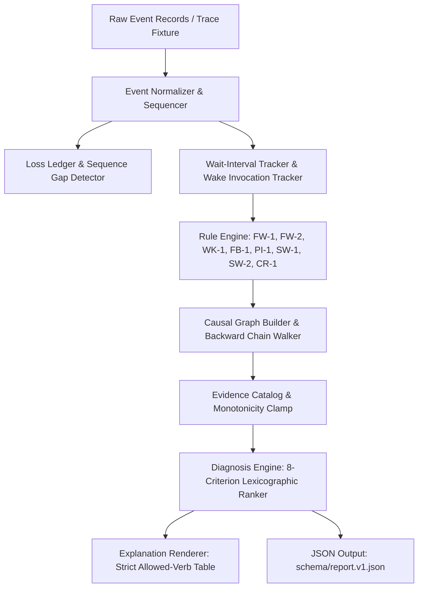

# Katana Phase 1 MVP: Technical Architecture, Implementation, and Validation Dossier

## 1. Executive Summary

Katana is a deterministic, evidence-explicit latency root-cause diagnosis engine for Linux systems. Rather than aggregating metrics or relying on heuristic scoring, Katana reconstructs explicit causal dependency chains from low-overhead kernel tracepoint events (`sched:sched_switch`, `sched:sched_waking`, and `syscalls:sys_enter/exit_futex`).

Phase 1 MVP delivers the pure analysis core, event normalization pipeline, causal graph builder, rule catalog (including Rule **FW-1** for futex wake attribution), evidence monotonicity engine, lexicographic diagnosis ranking engine, anti-inflation template renderer, and JSON report schema validation.

---

## 2. Architecture & Pipeline Data Flow

The Katana analysis engine processes trace events through an offline pipeline that operates as a pure function over the event stream:



### Component Breakdown

| Module | Source File | Core Responsibility |
|---|---|---|
| **Scheduler** | [`src/scheduler.rs`](file:///Users/atharvamendhulkar/desktop/katana/src/scheduler.rs) | Thread identity (`ThreadId`), provenance (`EventRef`), waker contexts (`Task`, `Irq`, `Kthread`), and scheduling states. |
| **Futex** | [`src/futex.rs`](file:///Users/atharvamendhulkar/desktop/katana/src/futex.rs) | Syscall command decoding (`FUTEX_WAIT`, `WAKE`, `LOCK_PI`, `WAIT_BITSET`, etc.), keys (`(scope, tgid, uaddr)`), PI-word snapshot decoding, and wait/wake interval tracking. |
| **Events & Normalizer** | [`src/events.rs`](file:///Users/atharvamendhulkar/desktop/katana/src/events.rs) | Deterministic sorting `(ts_ns, cpu, seq)` and detection of per-CPU sequence gaps populating `LossLedger`. |
| **Rule Catalog & Evidence** | [`src/evidence.rs`](file:///Users/atharvamendhulkar/desktop/katana/src/evidence.rs) | Typed evidence with static upper bounds (`rule.max_class()`), monotonicity enforcement, and degradation limitations. |
| **Causal Graph & Chains** | [`src/graph.rs`](file:///Users/atharvamendhulkar/desktop/katana/src/graph.rs) | Typed nodes and edges, bounded backward chain reconstruction (capped at depth 8), and cycle detection. |
| **Diagnosis Engine** | [`src/diagnosis.rs`](file:///Users/atharvamendhulkar/desktop/katana/src/diagnosis.rs) | Candidate finding generation, 8-criterion lexicographic ranking model, and ambiguity/contradiction resolution. |
| **Explanation Renderer** | [`src/renderer.rs`](file:///Users/atharvamendhulkar/desktop/katana/src/renderer.rs) | Template formatting with strict verb-table enforcement against claim inflation. |
| **Report Output** | [`src/output.rs`](file:///Users/atharvamendhulkar/desktop/katana/src/output.rs) | Serialization adhering to [`schema/report.v1.json`](file:///Users/atharvamendhulkar/desktop/katana/schema/report.v1.json). |
| **CLI & Entrypoint** | [`src/cli.rs`](file:///Users/atharvamendhulkar/desktop/katana/src/cli.rs), [`src/main.rs`](file:///Users/atharvamendhulkar/desktop/katana/src/main.rs) | Command parsing (`katana explain <PID>`), trace replay, and standard exit codes (0, 1, 2, 3, 4, 10, 11, 14). |

---

## 3. Kernel Semantics & Rule Catalog (Phase 1)

### 3.1 Rule FW-1: Futex Wake Causal Attribution (§10.4)
Rule FW-1 attributes edge `T2 →wakes→ T1 via futex A` if and only if all four preconditions hold:
1. `E3` and `E5` are enter/exit of a wake-family syscall on TID T2 with no intervening syscall.
2. `E4` (`sched_waking`, waker T2, wakee T1) satisfies `ts(E3) - ε <= ts(E4) <= ts(E5) + ε` (where `ε = 50 µs`), and on matching CPUs `seq(E3) < seq(E4) < seq(E5)`.
3. T1 has an open `FutexWait` or `PiWait` interval at `ts(E4)`.
4. For private futexes: `tgid(T1) == tgid(T2)` and `uaddr(T1) == uaddr(T2)`. For bitset futexes: `(wait_bitset & wake_bitset) != 0`.

- **Classification:** `CAUSAL / DERIVED` (strength `MODERATE` due to explicit `ASSUME_FUTEX_WAKE_ONLY` residual assumption).
- **Consistency Check:** The number of in-syscall matching wake events is compared against `sys_exit_futex.ret`. If `count_seen > ret`, a contradiction (`INCONSISTENT_WAKE_COUNT`) is recorded, downgrading edges to `Weak` and marking the diagnosis `AMBIGUOUS`.

### 3.2 Other Core Rules
- **`WK-1`:** Plain task wake outside of futex syscall (`CAUSAL / DIRECT`).
- **`WK-2`:** Wake from interrupt context (`WakerCtx::Irq`) → marked `OBSERVED`, never causal task wake.
- **`FW-2`:** Shared futex wake (cross-process address unverifiable) → `CAUSAL / DIRECT` (wake only) with `LIM_KEY_UNVERIFIABLE`.
- **`FB-1`:** Wait interval block summary (`OBSERVED`).
- **`PI-1`:** Priority Inheritance futex word snapshot (`owner = word & 0x3fffffff`) observed at wait entry (`OBSERVED / SNAPSHOT`).
- **`SW-1`:** Preemption edge from `sched_switch` (`CAUSAL / DIRECT`).
- **`SW-2`:** Runqueue delay interval (`OBSERVED`).
- **`CR-1`:** System context metrics (e.g. CPU pressure) (`CORRELATED / STATISTICAL`, **strictly forbidden from producing CAUSAL**).

---

## 4. Multi-Hop Chain Reconstruction & Bounded Caps (§12.3, §12.5)

Backward traversal begins at the subject's longest blocked interval:
1. Follow the `WokenBy` edge that terminated the wait interval.
2. Stop if terminal reason reached (`WAKER_RUNNING`, `WAKER_IRQ`, `HISTORY_BEFORE_TRACKING`, `TIMEOUT`, `INTERRUPTED`).
3. If waker is already visited in the active chain: stop with `TerminalReason::Cycle` and report `"observed wake cycle within window"` (not deadlock).
4. If hop count reaches `MAX_CHAIN_DEPTH = 8`: stop with `TerminalReason::DepthLimit` and mark diagnosis completeness as `PARTIAL`.
5. Locate waker's prior wait interval before the wake time. If none exists, waker was on-CPU (`WAKER_RUNNING`).

---

## 5. Anti-Inflation & Lexicographic Ranking Engine (§14, §15)

### 5.1 Strict Lexicographic Ranking
Findings are ordered lexicographically without arbitrary weighted scalar formulas:
1. **Subject relevance:** Direct block (1) vs indirect (0).
2. **Causal basis:** Contains ≥1 CAUSAL edge (1) vs only OBSERVED/CORRELATED (0).
3. **Explained fraction:** Integer per-mille of blocked time covered.
4. **Weakest-link strength:** `Strong` > `Moderate` > `Weak`.
5. **Completeness:** `Complete` > `Partial` > `Lossy` > `Invalid`.
6. **Shorter chain depth:** Fewer hops preferred.
7. **Repetition:** Number of occurrences.
8. **Tie-breaker:** Lowest start timestamp, lowest TID.

### 5.2 Allowed-Verb Enforcement Table
- `CAUSAL / DIRECT`: `"was woken by"`, `"was preempted by"`.
- `CAUSAL / DERIVED`: `"was released by a futex wake from"`.
- `OBSERVED`: `"was blocked for"`, `"entered ... wait on"`.
- `CORRELATED`: `"coincided with"`, `"overlapped with"` + mandatory suffix: `"This trace does not establish a causal link."`
- Non-PI ownership: Always rendered as `"owner: unknown (non-PI futex)"`.

---

## 6. Verification & Test Suite Matrix

The entire Phase 1 MVP test suite passes with **17/17 tests passing**:

```
running 2 tests (tests/anti_inflation_tests.rs)
test test_rule_max_class_invariants ... ok
test test_renderer_anti_inflation_lint ... ok
test result: ok. 2 passed; 0 failed

running 8 tests (tests/fault_injection_tests.rs)
test test_sched_runq_delay_2 ... ok
test test_negative_control_4 ... ok
test test_event_loss_ring_overflow_5 ... ok
test test_chain_cycle_detection_3d ... ok
test test_process_exit_during_window_6 ... ok
test test_multi_hop_wakeup_chain_3 ... ok
test test_futex_operation_variants_1c ... ok
test test_replay_determinism_and_monotonicity_8 ... ok
test result: ok. 8 passed; 0 failed

running 7 tests (tests/fw1_tests.rs)
test test_futex_wake_cross_cpu ... ok
test test_futex_wake_migration ... ok
test test_futex_wake_wrong_key ... ok
test test_futex_wake_multi_waiter ... ok
test test_futex_wake_single_waiter ... ok
test test_futex_wake_event_loss ... ok
test test_futex_wake_unrelated_waker ... ok
test result: ok. 7 passed; 0 failed
```

---

## 7. Current Status & Next Steps (Phase 2 Roadmap)

Phase 1 MVP core analysis, normalization, evidence, graph, and reporting engines are complete and fully validated. Phase 2 extends Katana with live Linux kernel BPF loading, block I/O request tracking, and cross-kernel CI matrix runners.
