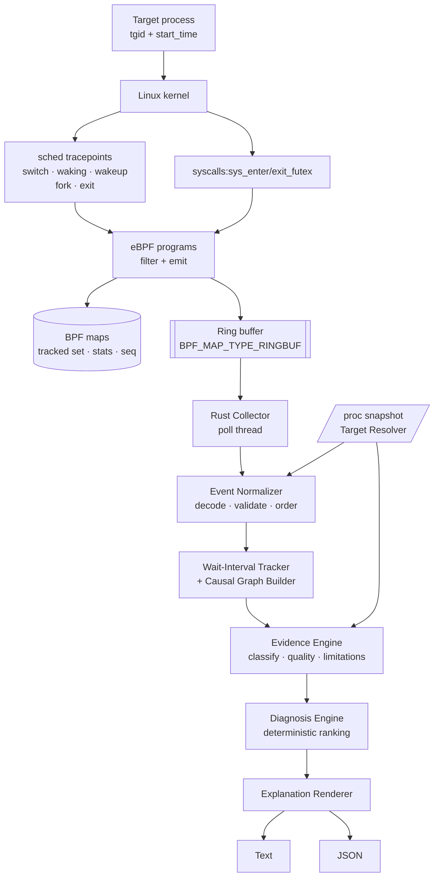
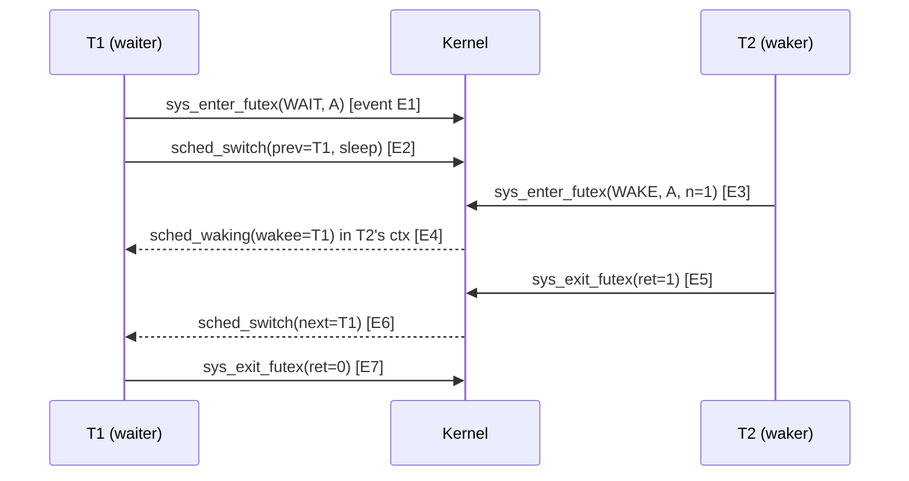

# Katana Technical PRD

| | |
|---|---|
| **Status** | Draft for implementation approval |
| **Version** | 1.0 |
| **Supersedes** | "Etiology" concept brief |
| **Scope of this document** | Phase 1 (MVP) in full detail; Phase 2 specified to the level needed to avoid architectural dead-ends; Phase 3 listed only |

**Conventions.** Every number is tagged **[HARD]** (a requirement the build must meet or the release is blocked), **[TARGET]** (an engineering target we design toward and measure), or **[OBJECTIVE]** (a benchmark objective we report against, with no pass/fail). No number in this document is a measured result. Items that cannot be resolved from documented Linux semantics are marked **OPEN TECHNICAL QUESTION (OTQ-n)** and list what must be verified experimentally; they are collected in §36.

---

## 1. Executive Summary

Katana is a single-host, single-command Linux diagnostic tool:

```
katana explain <PID>
```

It attaches a small, targeted set of eBPF programs (scheduler and futex tracepoints) for a bounded observation window, reconstructs what the target's threads were blocked on, and prints a short explanation in which **every claim is labelled by the kind of evidence behind it**:

- **CAUSAL**: a kernel event (or a composition of kernel events under documented kernel semantics) directly establishes the relationship.
- **CORRELATED**: two things overlapped in time or moved together; no kernel-recorded mechanism connects them.
- **OBSERVED**: a point-in-time fact about state (e.g. "thread was in `futex_wait` on address A at attach"), asserting no relationship.

The tool's contribution is **not** the collection mechanism (scheduler/futex tracing, wakeup chains and cross-subsystem dependency graphs are established prior art; see §6). The contribution is the *workflow and the honesty discipline*: one command, bounded cost, deterministic diagnosis, an evidence model that cannot be flattened into a single "confidence: HIGH", and a renderer that is structurally prevented from strengthening a claim.

Phase 1 is scheduler + futex only. Block I/O is Phase 2 and gated on the attribution rules in §32. Mutex ownership is reported only for PI futexes; otherwise `owner: unknown`.

---

## 2. Problem Definition

A Linux engineer facing a stuck or slow process today has, at the evidence level, `perf`, BCC (`offwaketime`, `wakeuptime`), `bpftrace`, `strace`, `/proc`. These expose raw facts. Converting them to "why is this thread not making progress" requires knowing which tool to run, reading stack-trace flame graphs or hex addresses, and mentally separating *what the kernel recorded* from *what overlapped in time*. Research systems (Prism, IPDPS 2026) automate dependency analysis but are offline, multi-signal, and require standing up a collector plus an analysis UI.

**Gap Katana targets:** the narrow case of "right now, on a box I have no dashboard for, tell me what this process is waiting for, and tell me exactly how much of that you actually know."

### 2.1 Definition of "blocked" (resolves Q19)

Katana distinguishes three non-running conditions. Conflating them is the most common source of wrong diagnoses.

| Condition | Kernel meaning | Observable as | Katana term |
|---|---|---|---|
| **Blocked (sleeping)** | Thread voluntarily left the CPU in `TASK_INTERRUPTIBLE` or `TASK_UNINTERRUPTIBLE` (not preempted) | `sched_switch` with `prev_state` ≠ running and not preempted | `BLOCKED` |
| **Runnable-delayed** | Thread is runnable (woken or preempted) but not on a CPU | `sched_wakeup`/`sched_waking` → `sched_switch` (next=thread) latency; or preemption → next switch-in | `RUNQ_DELAY` (scheduler delay) |
| **Stopped/other** | `TASK_STOPPED`, `TASK_TRACED`, zombie, idle | `/proc/<tid>/stat` state `T`,`t`,`Z`,`I`; `prev_state` bits | `STOPPED` (reported, not diagnosed) |

A thread is **"blocked for the purpose of diagnosis"** if, within the observation window, it has a `BLOCKED` interval of at least `MIN_BLOCK_NS` (default 10 ms **[TARGET]**, configurable only at build time in MVP), including an interval already open at attach (state `S`/`D` in `/proc`).

Waiting in `futex_wait` is *normal* for idle thread-pool workers. Katana therefore never diagnoses "all blocked threads"; it diagnoses a **subject** (§16: default = thread-group leader; `--tid` overrides) and lists other long-blocked threads in `--verbose` without interpretation.

---

## 3. Goals

| ID | Goal | Verified by |
|---|---|---|
| G1 | `katana explain <PID>` returns an evidence-labelled explanation within `duration + overhead` | §24, §31 |
| G2 | Every sentence in the explanation maps to ≥1 evidence record, and every evidence record maps to ≥1 raw kernel event (cpu, seq, ts) | Golden tests §26 |
| G3 | CAUSAL vs CORRELATED vs OBSERVED is explicit per evidence; no global confidence number | §13 |
| G4 | The tool says *unknown* / *incomplete* rather than guessing, including on event loss and unsupported mechanisms | §22, §25 |
| G5 | Bounded cost: targeted recording, bounded memory, bounded graph | §19 |
| G6 | Deterministic: identical raw trace ⇒ byte-identical JSON diagnosis | §14, replay tests |
| G7 | Reproducible correctness suite using fault injectors with known ground truth | §22 |
| G8 | Read-only: does not modify the target | §21 |

---

## 4. Non-Goals

Katana is **not**:

- a replacement for `perf` (no sampling profiler, no PMU counters, no flame graphs);
- a replacement for `bpftrace` / BCC (no user-programmable probes);
- a distributed-tracing system or a cloud/fleet product;
- a general observability platform, dashboard, or time-series store;
- an AI/LLM root-cause-analysis system (the MVP contains no ML of any kind);
- a generic lock-owner detector (owner is reported for PI futexes only);
- a kernel scheduler or a mitigation tool (no priority changes, no signals, no ptrace of the target);
- a CPU profiler in the traditional sense;
- a proof of causality from temporal correlation;
- a continuous monitor (no watch mode in Phase 1);
- universally Linux-compatible (see §20 for the support matrix).

**Scope-creep guard (normative).** Any change that adds a probe category, a new subsystem, a plugin interface, a persistent daemon, a network listener, or a probabilistic scoring layer requires a new ADR *and* a PRD revision. The CI check in §27 (`scripts/check-scope.sh`) fails the build if `bpf/` attaches to a tracepoint or kprobe not on the allow-list in §8.2.

---

## 5. Product Definition

### 5.1 Behaviour

1. Resolve `<PID>` to a target identity `(tgid, start_time)`; refuse if it does not exist or is not visible.
2. Take an initial **state snapshot** from `/proc` (thread states, `wchan`, and `/proc/<tid>/syscall` for blocked threads).
3. Load and attach the eBPF programs, populate the tracked set with the target's threads.
4. Observe for `duration` (default 3 s **[TARGET]**).
5. Detach; take a final snapshot; verify identity; run graph build → evidence → diagnosis → render.

An initially blocked thread whose waker never arrives in the window is a *legitimate, reportable outcome* (`FUTEX_WAIT_UNRESOLVED`), not a failure. Katana cannot observe a wake that has not happened.

### 5.2 Output principles

- The renderer may simplify evidence but **must not strengthen it** (§15 enforces this structurally with an allowed-verb table, not by convention).
- Output always has: subject, finding, evidence list with classes, limitations, collection quality.
- `Confidence` as a single word is **not** an output. Each evidence record carries `class`, `strength`, and `quality`; the diagnosis carries `completeness` (see §13.4).

### 5.3 Example (illustrative; final schema in §17)

```
Process 4217 (main thread T4217): BLOCKED 2.84 s of 3.00 s window.

Finding: futex wait, woken during window.                       [FUTEX_WAKE_CHAIN]
  T4217  FUTEX_WAIT_BITSET @0x7f3a…c40 (private)   blocked 2.84 s    [OBSERVED]
   └─ woken by T4221 via FUTEX_WAKE @0x7f3a…c40 at +2.91 s          [CAUSAL/derived]
       └─ T4221 had been blocked on FUTEX_WAIT @0x7f3a…d00 (+0.10–2.88 s)  [OBSERVED]
           └─ woken by T4230 (outside target process) at +2.88 s    [CAUSAL/direct]
               └─ earlier history of T4230 not observed (tracked from +2.88 s).

Also during the window:
  [CORRELATED] CPU pressure (PSI cpu some) rose from 0.4% to 31% across the window.
               This trace does not establish that CPU pressure affected T4217.

Limitations:
  • Mutex ownership not inferred: futex @0x7f3a…d00 is not a PI futex (owner: unknown).
  • Chain ends at T4230: its prior blocking occurred before tracking began.
Collection: 0 events lost; 3 CPUs saw activity; completeness: PARTIAL (chain truncated).
```

---

## 6. Prior Art and Positioning

Katana does **not** claim novelty for: eBPF scheduler tracing, futex tracing, wakeup-chain reconstruction, cross-subsystem correlation, or thread-dependency graphs.

| Work | What it establishes | Relationship to Katana |
|---|---|---|
| **Prism** (Landau, Barbosa, Saurabh; IPDPS 2026; Rust + libbpf; MIT) | Thread-granularity eBPF instrumentation of scheduler, futex, block I/O, VFS, network and multiplexing I/O; dependency graphs; validated on MySQL, Kafka, Cassandra, Redis and others; selective thread tracking; analysis UI | Closest prior art. Katana's collection layer is a strict, smaller subset. Prism is an offline, multi-signal research platform aimed at degradation analysis across a workload; Katana is a one-shot live explanation for one target. Katana adopts Prism's *selective thread tracking* idea and cites it as such. |
| **BCC `offwaketime`, `wakeuptime`** (Gregg, ~2015–16) | Off-CPU time with waker stacks across all blocking types; chained wakeup analysis | Katana does not claim wakeup-chain tracing. Katana's difference is output form (labelled narrative vs. folded stacks) and explicit evidence classes. |
| **`perf sched`, `perf trace`, `strace -f`, `bpftrace`** | General-purpose evidence collection | Katana is not a replacement (§4). |
| **Coroot, Pixie, Kindling** | eBPF-based RCA at service/request granularity | Different granularity and deployment model. Establishes that eBPF diagnosis is an established category. |
| **Linux PSI / `oomd`** | Kernel pressure signals used for proactive action | Katana uses PSI only as *CORRELATED* context. |

### 6.1 Differentiation

```
Expert tools (perf / BCC / bpftrace / strace)
        │  low-level evidence, no interpretation
        ▼
   manual interpretation by an expert   ◄── the gap
        ▼
Katana: single-host · single-command · bounded cost
        evidence-explicit · causal-vs-correlated · deterministic
        human-readable diagnosis traceable to raw events
```

Katana's claims (all falsifiable by the §22 suite): (1) a deterministic engine that never emits a CAUSAL label without a documented kernel-semantics rule; (2) structural prevention of claim inflation in the renderer; (3) explicit treatment of loss, truncation and unsupported mechanisms as first-class outputs.

The README must repeat this positioning and must not use the words "novel", "first", or "AI-powered".

---

## 7. System Architecture



### 7.1 Component specification

| Component | Responsibility | Inputs | Outputs | Ownership | Failure modes | Performance | Synchronization |
|---|---|---|---|---|---|---|---|
| **Target Resolver** (`target/`) | Validate PID; capture identity `(tgid, start_time_ticks, ns-pid)`; enumerate threads; take `/proc` snapshots (state, wchan, syscall) | PID, `/proc` | `TargetIdentity`, `Snapshot` | Main thread | PID missing; identity changes; EACCES on `/proc/*/syscall`; pid-namespace mismatch | O(threads) file reads; negligible | None (single thread) |
| **BPF programs** (`bpf/`) | Filter in kernel, emit fixed-size events, maintain tracked set, count drops | Tracepoint contexts | Ring buffer events; map state | Kernel; programs owned by skeleton object | Verifier rejection; attach failure; ring full; tracked-map full | Hot path: one hash lookup per hook invocation on non-tracked tasks | Per-CPU counters; hash map updates are atomic per-bucket; no cross-CPU locks of our own |
| **Collector** (`collector/`) | Load skeleton, attach, seed tracked set, poll ring buffer, read stats maps at end | Skeleton, config | `Vec<RawEvent>` batches via bounded channel; `CollectionStats` | Collector thread owns `RingBuffer`; main owns skeleton lifetime | `EPERM`, `ENOMEM` on ring alloc, poll stall → loss | Poll loop must drain faster than production; batch drain | One producer thread → `crossbeam_channel::bounded` → one consumer |
| **Normalizer** (`events/`) | Decode `#[repr(C)]` events, validate sizes/types, convert to typed `Event`, merge into a deterministic total order, detect per-CPU `seq` gaps | `RawEvent`s | `Vec<Event>` sorted; `LossLedger` | Main thread | Unknown event type (version skew); truncated record | O(n log n) over ≤ cap events | None |
| **Wait-Interval Tracker** (`graph/wait.rs`) | Per-TID state machine; build `WaitInterval`s (futex wait, other block, runq delay) | `Event`s in order | `WaitInterval`s; per-key wake windows | Main | Orphan exits, restart ambiguity | O(n) | None |
| **Graph Builder** (`graph/`) | Build bounded node/edge graph; attach evidence classification hooks | `WaitInterval`s, `Event`s | `CausalGraph` | Main | Cap hit (nodes/edges) | Caps enforced (§12.5) | None |
| **Evidence Engine** (`evidence/`) | Convert edges/facts into `Evidence` with class, strength, quality, limitations using the rule catalog | Graph, `LossLedger`, snapshots | `Vec<Evidence>` | Main | Rule not applicable → evidence downgraded, never upgraded | O(edges) | None |
| **Diagnosis Engine** (`diagnosis/`) | Deterministically rank findings; choose primary; surface contradictions | Evidence, graph | `Diagnosis` | Main | Contradiction → `AMBIGUOUS`; nothing qualifies → `UNKNOWN` | O(findings log findings) | None |
| **Renderer** (`renderer/`) | Template-based text; may only reference claims through a verb table keyed by (class, strength) | `Diagnosis`, evidence | `String` | Main | Template missing → fail closed with generic "see JSON" | negligible | None |
| **Output** (`output/`) | JSON serialization, stdout/stderr discipline, exit codes | `Report` | bytes | Main | Broken pipe | negligible | None |

**Threading model (decision):** two threads, no async runtime. The collector thread polls the ring buffer and sends batches; the main thread sleeps for the window, then joins the collector and processes the complete event set offline. Real-time analysis is not required for a single-shot tool, and offline analysis makes the pipeline a pure function of the trace, which is what enables deterministic replay tests (ADR-006).

---

## 8. eBPF Architecture

### 8.1 Programming model

- **C eBPF programs** under `bpf/`, compiled with `clang -target bpf -O2 -g`, **CO-RE** with `vmlinux.h` generated from the build host's BTF, loaded via **libbpf** from Rust through **libbpf-rs** (skeleton generated by `libbpf-cargo`). See ADR-002.
- Hooks: **tracepoints** (`tp/…`) wherever a stable tracepoint exists. No kprobes/fentry in the MVP allow-list.
- Ring buffer: `BPF_MAP_TYPE_RINGBUF`, **single shared buffer**, default 8 MiB **[TARGET]** (power-of-two multiple of page size). It is not a CLI option; the only override is the test-only environment variable `KATANA_RINGBUF_BYTES`, used by the event-loss tests.

### 8.2 Hook allow-list (normative)

| Hook | Purpose | Mandatory |
|---|---|---|
| `sched:sched_switch` | On/off-CPU transitions, preemption, state | Yes |
| `sched:sched_waking` | **Waker attribution** (fires in waker's context) | Yes |
| `sched:sched_wakeup` | Wakee became runnable on target rq (queue-delay start) | Yes |
| `sched:sched_wakeup_new` | New task first wake (to keep run-queue accounting correct for new threads) | Yes |
| `sched:sched_process_fork` | Thread creation → extend tracked set | Yes |
| `sched:sched_process_exit` | Thread exit → shrink tracked set; target-exit detection | Yes |
| `syscalls:sys_enter_futex`, `syscalls:sys_exit_futex` | Futex operation, args, return | Yes |
| `syscalls:sys_enter_futex_waitv`, `…futex_wait`, `…futex_wake`, `…futex_requeue` | **Detection only** (emit `UNSUPPORTED_SYSCALL` for tracked TIDs so the tool can report futex2 usage) | Optional (attach if tracepoint exists) |

`sched_process_exec` and `sched_migrate_task` are deliberately **not** attached.

### 8.3 Maps

| Map | Type | Key → Value | Size | Purpose |
|---|---|---|---|---|
| `tracked` | `HASH` | `u32 tid` → `struct tracked {u64 start_boottime; u32 tgid; u8 depth; u8 flags;}` | 1024 entries [HARD cap]; policy cap 256 [TARGET] | Dependency set |
| `seq` | `PERCPU_ARRAY` | 0 → `u64` | 1 | Per-CPU event sequence numbers |
| `stats` | `PERCPU_ARRAY` | enum idx → `u64` | ~16 | `ringbuf_reserve_fail`, `tracked_full`, `expand_denied_*`, hook invocation counts, `read_user_fail` |
| `.rodata` config | `const volatile` | `target_tgid`, `max_depth`, `max_tracked`, flags | — | Set before load; immutable thereafter |

### 8.4 Filtering strategy

Programs begin with the cheapest possible test. Targeted *recording*, not zero *invocation*: tracepoint programs execute on every matching system event, so each handler must early-exit after one hash lookup. This cost is measured in §24 (BPF handler ns/call, system-wide switch-rate sensitivity) and not assumed to be low.

| Hook | Emit when |
|---|---|
| `sched_switch` | `tracked(prev)` or `tracked(next)` |
| `sched_waking` | `tracked(wakee)` **or** (`tracked(waker)` **and** waker is inside an in-flight futex *wake-family* syscall) |
| `sched_wakeup` | `tracked(wakee)` |
| `sched_process_fork` | `tracked(parent)`; add child if same `tgid` |
| `sched_process_exit` | `tracked(tid)`; remove entry |
| `sys_enter_futex` / `sys_exit_futex` | `tracked(current tid)` |

### 8.5 Dependency expansion (target → waker → waker's dependencies)

Expansion happens **in the kernel**, in `sched_waking`, because userspace is too late: by the time userspace sees the event, the waker's *subsequent* events have already been dropped by the filter.

```
on sched_waking(waker=current, wakee=p):
    if tracked(p) and depth(p) < MAX_DEPTH:
        eligible(waker) :=
            waker is a user thread (task->flags & PF_KTHREAD == 0)
            AND waker is in process context (not hardirq/softirq/NMI)   // else waker unattributed
            AND waker != idle (pid 0)
            AND tracked_count < MAX_TRACKED
        if eligible and not tracked(waker):
            tracked[waker.tid] = {depth: depth(p)+1, tgid, start_boottime, flags: EXPANDED}
            emit TRACK_ADD
        elif not eligible:
            stats.expand_denied_{kthread|irq|full|depth}++
            set flag on emitted event so userspace knows why the chain stops
```

Properties and honest limits:

- Expansion adds a **single TID**, never a whole process and never kernel threads, so growth is bounded by `MAX_TRACKED` and `MAX_DEPTH` (defaults 256 / 8 **[TARGET]**; map hard cap 1024 **[HARD]**).
- A newly tracked waker's **history before tracking is not observed** (e.g. what it was blocked on before waking the wakee). This is the main truncation mode and is always reported as `LIM_HISTORY_BEFORE_TRACKING` in the evidence. Same-process helper threads are tracked from the start and are not affected.
- If the waker was inside a futex syscall when added, its `sys_enter_futex` was missed: the wake edge remains CAUSAL/direct but the *futex-key association* is unavailable (`LIM_EXPANDED_MID_SYSCALL`).
- Expansion is **not undone** when the chain is later found irrelevant; entries are removed on thread exit or at detach. Cost is bounded by caps.
- Wakeups from hardirq/softirq (timers, I/O completion) have `current` = an unrelated interrupted task. Katana records `WAKER_IN_IRQ` and emits `waker: unattributed (interrupt context)`; it never names the interrupted task as a waker. Detecting interrupt context from BPF is architecture-specific (see **OTQ-1**).

### 8.6 Loss detection

1. Every event carries `(cpu, seq)`; `seq` is a per-CPU monotonically increasing counter incremented *before* `bpf_ringbuf_reserve`. A failed reserve consumes a sequence number, so the gap is visible at the next successful event on that CPU.
2. `stats.ringbuf_reserve_fail` counts failures (exact count of lost events, as long as the stats map read succeeds).
3. Userspace compares both: gaps observed vs. failures counted. A mismatch is reported as `LOSS_UNRECONCILED`.
4. Lost events are bounded in time by the timestamps of the events before and after the gap on that CPU → a **loss interval** `(cpu, t_lo, t_hi, n_lost)` used by the completeness logic in §13.4.
5. `tracked_full` and `read_user_fail` are separate, named loss classes (they cause *missing evidence*, not missing events).

---

## 9. Scheduler Instrumentation

All `pid` fields in tracepoint formats are **kernel TIDs** (thread IDs). `tgid` is obtained with `bpf_get_current_pid_tgid() >> 32` for `current`, or by CO-RE read of `task->tgid` for other tasks (`bpf_task_from_pid` is not required; use `bpf_get_current_task_btf` only for `current`).

### 9.1 What each tracepoint provides (resolves Q1, Q2)

| Tracepoint | Fields (format) | Executes in context of | What it establishes causally | What it does **not** establish |
|---|---|---|---|---|
| `sched_waking` | `comm, pid, prio, target_cpu` (wakee) | **The waker** (`current` = the thread executing `try_to_wake_up`) in the normal case; fires after the state-match check, so only for actual wakeups | "Thread `current` executed a wakeup on wakee `pid`" — a **direct kernel record of the mechanism**. | Not the *logical* originator if the waker is itself acting for someone else (e.g. a worker thread, a kworker, an io_uring worker); not valid for attribution when `current` is in interrupt context. |
| `sched_wakeup` | `comm, pid, prio, target_cpu` | The CPU that enqueues the wakee. For remote wakeups queued via wake lists this can be an IPI handler on the *target* CPU, where `current` is **not** the waker. | "Wakee became runnable on CPU `target_cpu`" (start of run-queue delay). | **Never used for waker identity.** This is why `sched_waking` is mandatory. |
| `sched_wakeup_new` | same | Parent/forker | First wake of a new task | — |
| `sched_switch` | `prev_comm, prev_pid, prev_prio, prev_state, next_comm, next_pid, next_prio` | The CPU doing the switch | "prev left CPU c at t in state s; next entered CPU c at t." Preemption vs. voluntary sleep is distinguishable (see below). | Which resource prev waits on. Which wake (if any) will end the sleep. |
| `sched_process_fork` | `parent_pid, child_pid` (+comms) | Parent | Thread/process creation relationship | — |
| `sched_process_exit` | `pid, prio` (+comm) | Exiting task | Task is exiting | — |

**Answer Q1.** `sched_waking` establishes that a specific thread invoked the kernel wakeup path for a specific sleeping task at a specific time. It establishes the **mechanism** of this wakeup; it does not establish *why* the waker chose to wake, nor that the wakee's delay was "because of" the waker's earlier actions beyond what the surrounding wait/wake semantics (§10) show.

**Answer Q2.** No. The actual waker cannot be identified from `current` when (a) the wake occurs in hardirq/softirq context (timers, I/O completion, RCU), (b) the wake occurs on a wake-list in an IPI handler (only affects `sched_wakeup`, which is why it is not used for identity), (c) the wake is performed by an intermediary (kworker, io_uring, helper thread). Katana flags (a) via `WAKER_IN_IRQ`, flags kernel-thread wakers via `WAKER_KTHREAD`, and reports (c) only as "woken by thread X" (the mechanism), never as X being the logical cause.

### 9.2 `sched_switch` details

- **Preemption vs. sleep:** In the tracepoint payload `prev_state` is the task's state with a preemption indicator added by the kernel when the task was switched out while still runnable. The exact encoding differs across kernel versions (`TASK_REPORT_MAX` bit vs. a separate `preempt` flag in newer `trace_sched_switch` signatures). Katana normalizes to `sflags: PREEMPTED` in BPF using CO-RE-based field/enum existence checks. **OTQ-2:** verify per supported kernel that `PREEMPTED` ⇔ prev still runnable, using a pinned CPU-hog test.
- **State bits recorded:** `TASK_INTERRUPTIBLE`, `TASK_UNINTERRUPTIBLE`, `__TASK_STOPPED`, `__TASK_TRACED`, exit bits; stored raw (u32) plus normalized.
- **I/O wait flag:** `task->in_iowait` of `prev` is read via CO-RE (`bpf_core_field_exists`) and recorded as `sflags: IN_IOWAIT`. It indicates the kernel considered the thread to be in an I/O wait. It does **not** identify device or request. MVP uses it only to emit `UNSUPPORTED_ATTRIBUTION` (see §15) instead of misattributing an I/O block to a futex.
- **CPU:** `bpf_get_smp_processor_id()`; recorded in the header.
- **Timestamps:** `bpf_ktime_get_ns()` (`CLOCK_MONOTONIC`, excludes suspend). Chosen (resolves Q12) because it is monotonic, cheap, and available on all supported kernels. Suspend/resume during a window invalidates it: Katana detects a large `CLOCK_BOOTTIME − CLOCK_MONOTONIC` delta change between snapshots and emits `LOSS_CLOCK_DISCONTINUITY`.
- **Ordering across CPUs (resolves Q11):** within one CPU, `seq` gives a total order. Across CPUs there is no total order that Katana trusts at sub-microsecond resolution. Causal edges therefore do not rely on cross-CPU timestamp ordering except through a **tolerance `ε = 50 µs` [TARGET]** (OTQ-3: calibrate by measuring inter-CPU clock skew on the supported hardware matrix). A wake and the following switch-in are accepted as ordered if `t_switch_in ≥ t_waking − ε`.

### 9.3 Target thread filter

See §8.4/§8.5. Identity is `(tid, start_boottime)`; a mismatch between a tracked entry's `start_boottime` and `task->start_boottime` (CO-RE: `start_boottime`, with a `real_start_time` fallback via field-existence check) deletes the stale entry and sets `TID_REUSE_SUSPECTED` on the next event.

### 9.4 Derived scheduler quantities (userspace)

| Quantity | Definition | Evidence class |
|---|---|---|
| Blocked interval | `[sched_switch(prev=T, non-preempted sleep), next switch-in of T]` | OBSERVED |
| Run-queue delay (post-wake) | `t(switch-in of T) − t(sched_wakeup(T))` | OBSERVED (direct measurement) |
| Run-queue delay (post-preempt) | `t(next switch-in of T) − t(switch-out preempted)` | OBSERVED |
| Preemptor | `next_pid` of the switch that preempted T | CAUSAL/direct ("T was switched out in favour of N") |
| CPU saturation context | PSI `cpu` / `/proc/stat` over window | CORRELATED only |

---

## 10. Futex Instrumentation

### 10.1 Hooks and fields

`syscalls:sys_enter_futex` fields: `uaddr, op, val, utime, uaddr2, val3`. `syscalls:sys_exit_futex`: `ret`. These are architecture-neutral tracepoints present on x86_64 and arm64 when `CONFIG_FTRACE_SYSCALLS=y`. 32-bit compat futex entry points (e.g. `futex_time32`) are **not** instrumented in the MVP; a tracked 32-bit process on a 64-bit kernel is reported `UNSUPPORTED_ATTRIBUTION` (**OTQ-4:** confirm detection via `task->thread_info.flags & TIF_32BIT`/arch equivalent).

`cmd = op & FUTEX_CMD_MASK` (strip `FUTEX_PRIVATE_FLAG` = 128 and `FUTEX_CLOCK_REALTIME` = 256). `private = op & 128`.

### 10.2 Operation handling table

| Operation (cmd) | Role | Recorded | Katana representation | MVP claims |
|---|---|---|---|---|
| `FUTEX_WAIT` (0) | Waiter | `uaddr`, `val`, timeout present?, private | `FutexWait{key, bitset: ALL}` | Wait interval on `key`; end classified by `ret` |
| `FUTEX_WAIT_BITSET` (9) | Waiter | + `val3` bitset | `FutexWait{key, bitset: val3}` | As above; bitset recorded; wake pairing requires `wake.bitset & wait.bitset ≠ 0` |
| `FUTEX_WAKE` (1) | Waker | `uaddr`, `val`=max wakes | `FutexWake{key, max: val}` | Pairing via in-syscall `sched_waking` (§10.4) |
| `FUTEX_WAKE_BITSET` (10) | Waker | + `val3` | `FutexWake{key, bitset}` | As above with bitset intersection |
| `FUTEX_LOCK_PI` (6) / `FUTEX_LOCK_PI2` (13) / `FUTEX_TRYLOCK_PI` (8) | PI waiter/locker | `uaddr`, **futex word snapshot** (`bpf_probe_read_user`) | `PiWait{key, owner_snapshot}` | **Only operation with an owner claim** (§10.5) |
| `FUTEX_UNLOCK_PI` (7) | PI waker | `uaddr` | `PiUnlock{key}` | Pairing via in-syscall `sched_waking` |
| `FUTEX_REQUEUE` (3), `FUTEX_CMP_REQUEUE` (4), `FUTEX_WAKE_OP` (5) | Mixed: wakes some, moves others to `uaddr2` | `uaddr`, `uaddr2`, `val`, `val3` | `FutexRequeue{key1,key2}` / `FutexWakeOp` | Wake edges stay CAUSAL/direct; **key association downgraded** and `LIM_REQUEUE_AMBIGUOUS_KEY` added: requeued waiters continue waiting on `key2` without a new syscall |
| `FUTEX_WAIT_REQUEUE_PI` (11), `FUTEX_CMP_REQUEUE_PI` (12) | PI-condvar | recorded | `UnsupportedFutexOp` | No futex claim; wake edges only; `LIM_UNSUPPORTED_FUTEX_OP` |
| `FUTEX_FD` (2) | Removed from kernel | — | Unknown op | — |
| futex2 syscalls (`futex_waitv`, `futex_wait`, `futex_wake`, `futex_requeue`) | Not traced beyond detection | `UNSUPPORTED_SYSCALL` | — | `LIM_FUTEX2_NOT_SUPPORTED` |

### 10.3 Terminology (never conflate these)

| Term | Definition in Katana | Source of truth |
|---|---|---|
| **futex address** (`uaddr`) | User virtual address passed to the syscall | Syscall arg |
| **futex key** | `(scope, tgid, uaddr)` where scope ∈ {`private`, `shared-or-unknown`}. For `FUTEX_PRIVATE_FLAG` ops the kernel key is `(mm, address)`, so same-`tgid` ⇒ same key. For shared futexes the kernel keys on the underlying page/inode, which Katana **cannot compute** from virtual addresses; cross-process shared-futex pairing is therefore unavailable in the MVP | Derived |
| **futex operation** | `cmd` + flags | Syscall arg |
| **waiter** | Thread with an open `FutexWait`/`PiWait` interval (entered, not yet exited) | `sys_enter`/`sys_exit` |
| **waker** | Thread inside a wake-family futex syscall that issued `sched_waking` on a waiter | §10.4 |
| **owner** | Thread that holds the lock; **unknown for non-PI futexes** | Not derivable |
| **PI owner** | TID in the low 30 bits of the futex word *as observed at wait entry* of a PI operation | §10.5 |

### 10.4 Wait/wake pairing (resolves Q3, Q4)

The kernel does not tell userspace *which* waiter a wake released: `FUTEX_WAKE` returns only a count. Katana pairs using **interval containment of kernel wakeups inside the waker's futex syscall**:



Rule **FW-1** (edge `T2 →wakes→ T1 via futex A`): all of
1. `E3` and `E5` are the enter/exit of a wake-family op on tid T2 (same tid, nested, no intervening enter on T2);
2. `E4` (`sched_waking`, `current`=T2, wakee=T1) satisfies `ts(E3) − ε ≤ ts(E4) ≤ ts(E5) + ε`, and on the same CPU `seq(E3) < seq(E4) < seq(E5)`;
3. T1 has an **open** `FutexWait`/`PiWait` interval at `ts(E4)` (entered, no exit yet);
4. for private ops: `tgid(T1) == tgid(T2)` and `uaddr` equal; for bitset ops: `bits(wait) & bits(wake) ≠ 0`.

Strength by conditions satisfied:

| Satisfied | Evidence | Why |
|---|---|---|
| 1,2,3,4 (private, same address) | **CAUSAL / DERIVED** "T2's FUTEX_WAKE on A woke T1 (waiting on A)" | Kernel semantics: only futex wakeups are issued by `futex_wake` for waiters of that key |
| 1,2,3 but 4 not checkable (shared, cross-tgid) | **CAUSAL / DIRECT (wake) + futex relation UNKNOWN** "T2 woke T1 while T2 was in a futex wake syscall and T1 was in a futex wait; key association not verifiable" | Address not comparable across address spaces |
| 2 only (T2 not in futex syscall) | **CAUSAL / DIRECT** "T2 woke T1" with no futex claim | Plain wake |
| 1,2 but T1 has no open futex interval | Plain wake; `LIM_NO_OPEN_FUTEX_WAIT` | Could be unrelated in-syscall wake (e.g. an `mmap_lock` release) |

**Residual assumption (stated in evidence):** a `sched_waking` of a task *that is in a futex wait* issued from inside the waker's futex wake syscall is the futex wake. Unrelated in-syscall wakeups (rwsem/mmap lock release) could target other tasks but not a thread sleeping in `futex_wait_queue`; this assumption is listed as `ASSUME_FUTEX_WAKE_ONLY` and covered by the §22 multi-waiter test (**OTQ-5**).

**Multiple waiters:** `FUTEX_WAKE(n)` produces up to n `sched_waking` events inside the interval; each yields a separate edge. **Consistency check:** `ret(E5)` must equal the number of in-interval `sched_waking` events targeting threads in futex waits *whose events were recorded*. If `count_seen < ret` ⇒ some wakees were untracked (acceptable, recorded as `wakes_untracked = ret − seen`) **or** events were lost (check loss ledger). If `count_seen > ret` ⇒ contradiction (`INCONSISTENT_WAKE_COUNT`), the affected edges are downgraded to `maybe`.

**Traceability Status:**
- `FW-1` = **IMPLEMENTED + TESTED**
  - Implementation: `src/futex.rs`, `src/scheduler.rs`, `src/causal_rules.rs`
  - Tests: `test_futex_wake_single_waiter`, `test_futex_wake_multi_waiter`, `test_futex_wake_wrong_key`, `test_futex_wake_cross_cpu`, `test_futex_wake_migration`, `test_futex_wake_event_loss`, `test_futex_wake_unrelated_waker` (7/7 PASS)
  - Reference: `research.md` §6.4 & §6.11 (draft reference on futex instrumentation and causal attribution)

### 10.5 PI futexes (resolves Q8)

For `FUTEX_LOCK_PI`, `FUTEX_LOCK_PI2`, `FUTEX_TRYLOCK_PI` the kernel-defined futex-word ABI is: bits 0–29 = owner TID (`FUTEX_TID_MASK`), bit 30 = `FUTEX_OWNER_DIED`, bit 31 = `FUTEX_WAITERS`. Katana reads the 32-bit word with `bpf_probe_read_user` at `sys_enter_futex` and records the raw word. Rules:

- If the read succeeds, `owner_tid = word & 0x3fffffff`; `owner_tid == 0` ⇒ unowned (no claim).
- Claim: **"At wait entry the futex word named TID N as owner"** — class OBSERVED, strength DIRECT. The follow-on claim "T is blocked behind N's lock" is CAUSAL/DERIVED because PI semantics (the kernel enforces and boosts the owner) make the futex word the kernel's own owner record.
- The value is a **snapshot** at entry; ownership may change while T waits. Evidence carries `valid_at: wait_entry`. If a later `FUTEX_UNLOCK_PI` by the observed owner on the same key occurs while T is waiting, a pairing under FW-1 is added.
- **Namespaces (OTQ-6):** the TID in the word is in the caller's PID namespace. MVP requires target's pid namespace == Katana's; otherwise `owner: unknown`, `LIM_PIDNS_MISMATCH`.
- `bpf_probe_read_user` can fail (page not resident). Then `owner: unknown`, `LIM_PI_WORD_UNREADABLE`, counted in `stats.read_user_fail`.
- A cycle of observed PI owners (T→O→…→T) is reported as an **observed PI owner cycle** (the kernel itself returns `-EDEADLK` on detection; this is a snapshot cycle, not a proof of deadlock).

### 10.6 Non-PI futex ownership (design constraint)

Katana **never** emits `owner` for a non-PI futex. Reasons:

1. A plain futex word has no kernel-defined owner field; its meaning is a userspace convention (0/1/2 states in glibc's low-level lock; arbitrary in custom locks).
2. glibc `pthread_mutex_t` stores an owner TID in a struct field at a libc-version-specific offset; reading it needs userspace-memory access keyed to ABI layout that differs between glibc versions, musl, and custom implementations.
3. Even where a TID is stored, it can be stale, and it cannot be matched to a *futex address* without knowing the mutex object layout.

Data model: `owner: Option<ThreadRef>` is `None` with `owner_status: Unknown(reason)` where `reason ∈ {NonPiFutex, PiWordUnreadable, PidnsMismatch, OwnerZero}`. The renderer prints `owner: unknown (non-PI futex)` — never omits it silently.

### 10.7 Wait outcomes by `ret` (resolves Q5, Q6, Q7)

| `ret` at `sys_exit_futex` | Meaning | Katana outcome |
|---|---|---|
| `0` (WAIT family) | Woken (by `FUTEX_WAKE`/unlock/requeue) **or** returned without sleeping after a value-check pass | `WOKEN`; paired with a waker if FW-1 applies else `WOKEN_UNATTRIBUTED` (waker outside tracking, interrupt-context wake, or lost event; exactly one cause is *not* asserted) |
| `-EAGAIN` (-11) | `*uaddr != val` at entry; never slept | `NO_SLEEP_VALUE_MISMATCH` (no blocking interval) |
| `-ETIMEDOUT` (-110) | Timeout elapsed | `TIMEOUT` — **no waker** expected; reported as "wait ended by timeout" |
| `-EINTR` (-4) | Interrupted by signal handler | `INTERRUPTED` — no waker claim |
| `-ERESTARTSYS` (-512), `-ERESTARTNOINTR` (-513), `-ERESTARTNOHAND` (-514), `-ERESTART_RESTARTBLOCK` (-516) | Restart codes visible at the tracepoint | `INTERRUPTED_MAY_RESTART`: for `-ERESTART_RESTARTBLOCK` the wait may **continue under `restart_syscall` without a new `sys_enter_futex`**. Katana closes the interval, marks the TID `restart_pending`; a subsequent wake of that TID with no new futex enter is reported as plain wake with `LIM_FUTEX_RESTART_AMBIGUOUS` (**OTQ-7:** verify exact values at the tracepoint) |
| `-ENOSYS`, `-EINVAL`, `-EPERM`, others | Error | `ERROR(code)`; no claim |

**Spurious wakeups (Q5):** "spurious" is a userspace condition-variable concept; the kernel cannot distinguish. A `ret=0` wait with no attributable waker is `WOKEN_UNATTRIBUTED`, never "spurious".

---

## 11. Event Model

### 11.1 Lifecycle

```
kernel event → eBPF struct (fixed, #[repr(C)], ≤ 96 B) → ringbuf record
  → RawEvent (bytes + len) → Event (typed enum) → ordered Event stream
  → WaitInterval / GraphEdge → Evidence → Finding → Diagnosis → Report
```

Every downstream object keeps `EventRef { cpu: u16, seq: u64 }`, so any sentence in the output can be traced to raw events (principle 10). `--verbose` and JSON print these refs.

### 11.2 Wire format (eBPF → userspace)

```c
struct kt_hdr {            // 32 bytes
    u64 ts_ns;             // bpf_ktime_get_ns() (CLOCK_MONOTONIC)
    u64 seq;               // per-CPU, incremented before reserve
    u32 tid;               // current->pid (kernel TID)
    u32 tgid;              // current->tgid
    u16 cpu;
    u8  type;              // enum kt_type
    u8  flags;             // KT_F_WAKER_IRQ | KT_F_WAKER_KTHREAD | KT_F_EXPAND_DENIED | KT_F_TRUNC ...
};
// payloads (tagged by hdr.type), each ≤ 64 B:
struct kt_switch  { u32 prev_tid, next_tid; u32 prev_state; u16 sflags; u16 pad; u32 next_tgid; u32 prev_tgid; };
struct kt_wake    { u32 wakee_tid; u32 wakee_tgid; u16 target_cpu; u16 sflags; u32 depth_added; };  // sched_waking / sched_wakeup / wakeup_new
struct kt_futex_enter { u64 uaddr, uaddr2; u32 op, val, val3; u32 pi_word; u8 pi_word_valid; u8 has_timeout; u16 pad; };
struct kt_futex_exit  { s64 ret; };
struct kt_task    { u32 child_tid, child_tgid; };                       // fork / exit / track_add
```

- `type` enum: `SWITCH, WAKING, WAKEUP, WAKEUP_NEW, FORK, EXIT, TRACK_ADD, FUTEX_ENTER, FUTEX_EXIT, UNSUPPORTED_SYSCALL`.
- A `u16 abi_version` is recorded once in a `META` record at the start of each trace; userspace rejects a mismatch (`E_ABI_MISMATCH`).
- Struct layout is checked at build time with `static_assert`/`const_assert` on both the C side and the Rust side (`bindgen`-generated types are the single source of truth).

### 11.3 Rust types (userspace)

```rust
pub struct EventRef { pub cpu: u16, pub seq: u64 }

pub struct ThreadId { pub tid: u32, pub tgid: u32 }          // identity inside one trace

pub struct Event {
    pub ts_ns: u64,
    pub r#ref: EventRef,
    pub thread: ThreadId,         // 'current' at emission
    pub flags: EventFlags,
    pub kind: EventKind,
}

pub enum EventKind {
    Switch   { prev: ThreadId, next: ThreadId, prev_state: TaskState, preempted: bool, in_iowait: bool },
    Waking   { wakee: ThreadId, waker_ctx: WakerCtx },       // WakerCtx::{Task, Irq, Kthread, Unknown}
    Wakeup   { wakee: ThreadId, target_cpu: u16 },
    WakeupNew{ wakee: ThreadId, target_cpu: u16 },
    Fork     { child: ThreadId },
    Exit,
    TrackAdd { tid: u32, depth: u8 },
    FutexEnter(FutexEnter),
    FutexExit{ ret: i64 },
    UnsupportedSyscall { nr: u32 },
}

pub struct FutexEnter {
    pub uaddr: u64, pub uaddr2: u64,
    pub cmd: FutexCmd,            // typed; Unknown(u32) allowed
    pub private: bool, pub val: u32, pub val3: u32,
    pub has_timeout: bool,
    pub pi_word: Option<u32>,
}
```

Design notes: (1) `thread` in the header is always the *emitting* context, not the subject; the subject is in the payload. (2) `causal_status` is deliberately **not** a field of raw events: raw events are facts; classification belongs to the evidence layer where the rule that justified it is recorded. (3) `resource` and `operation` from the brief are represented by `FutexEnter.uaddr`/`cmd` and by `WaitInterval.kind`.

### 11.4 Ordering and the total order (resolves Q11)

Normalizer sorts by `(ts_ns, cpu, seq)`. This is a **presentation and processing order**, not a causality claim. Causal rules never depend on it except where they say "within ε" (§9.2). The only order guaranteed correct is per-CPU `seq` order; the normalizer asserts per-CPU monotonic `ts_ns` and counts violations (`CLOCK_ANOMALY`).

### 11.5 Loss ledger

```rust
pub struct LossInterval { pub cpu: u16, pub t_lo: u64, pub t_hi: u64, pub n_lost: u64 }
pub struct LossLedger {
    pub intervals: Vec<LossInterval>,          // from seq gaps
    pub reserve_fail_total: u64,               // from stats map
    pub tracked_full: u64, pub expand_denied: ExpandDenied,
    pub read_user_fail: u64,
    pub unreconciled: bool,                    // gaps ≠ counter
}
```

Detection of a **missing final event on a CPU** (loss after the last successful event): the stats counter exceeds the sum of observed gaps; the remainder is recorded as a trailing loss with `t_hi = window_end`.

### 11.6 Version skew

Unknown `type` ⇒ the event is skipped, counted `unknown_type`, and the diagnosis `completeness` cannot be `COMPLETE`.

---

## 12. Causal Graph

### 12.1 Node and edge definitions

```rust
pub enum NodeKind {
    Thread(ThreadKey),            // (tid, tgid, first_seen_boottime)
    FutexKey(FutexKey),           // (scope, tgid, uaddr)
    CpuRunq(u16),                 // per-CPU run queue, used only for RUNQ_DELAY correlation edges
    Unattributed(UnattrReason),   // WAKER_IRQ | WAKER_KTHREAD | OUTSIDE_TRACKED | LOST
}
```

(Device, I/O-request nodes: Phase 2 only. They are not present in the Phase 1 enum so the compiler prevents accidental use.)

```rust
pub enum Relation {
    Waits,                  // Thread → FutexKey      (OBSERVED)
    WokenBy,                // Thread(wakee) ← Thread(waker), from sched_waking (CAUSAL/direct)
    FutexWake,              // Thread(waker) → FutexKey (+ link to waits it released)   (CAUSAL/derived)
    BlockedFor,             // Thread → Interval summary (OBSERVED)
    PreemptedBy,            // Thread ← Thread (CAUSAL/direct, from sched_switch)
    RunqDelayed,            // Thread → CpuRunq (OBSERVED measurement)
    PiOwnerAtEntry,         // Thread(waiter) → Thread(owner)   (OBSERVED, valid_at wait_entry)
    CorrelatesWith,         // Thread/Interval ↔ Context(metric)  (CORRELATED only)
}

pub struct Edge {
    pub id: EdgeId,
    pub src: NodeId, pub dst: NodeId,
    pub relation: Relation,
    pub t_start: u64, pub t_end: u64,
    pub class: EvidenceClass,        // Causal | Correlated | Observed
    pub basis: EvidenceBasis,        // Direct | Derived | Statistical | Snapshot
    pub rule: RuleId,                // FW-1, WK-1, ...
    pub provenance: Vec<EventRef>,   // raw events (bounded, ≤ 8 per edge)
    pub limitations: SmallVec<[Limitation; 4]>,
}
```

**Invariant (enforced by the type system and a test):** `Edge::new` takes `class` from `rule.max_class()`. A rule's `max_class` is static data in the rule catalog; evidence code can only downgrade (e.g. due to loss), never upgrade.

### 12.2 Rule catalog (Phase 1)

| Rule | Produces | Max class | Preconditions (all must hold) |
|---|---|---|---|
| **WK-1** | `WokenBy(wakee ← waker)` | CAUSAL / direct | `sched_waking` with `current`=waker (task context, not IRQ), wakee tracked or waker tracked |
| **WK-2** | `WokenBy` with waker `Unattributed(Irq)` | OBSERVED | waking event flagged `WAKER_IRQ` |
| **FW-1** | `FutexWake` + `WokenBy` annotated with futex key | CAUSAL / derived | §10.4 conditions 1–4 |
| **FW-2** | `WokenBy` with `LIM_KEY_UNVERIFIABLE` | CAUSAL / direct (wake only) | futex wake syscall + open futex wait, key not comparable |
| **FB-1** | `Waits(Thread→FutexKey)` + `BlockedFor` | OBSERVED | `FutexEnter(WAIT*)` … `Switch(prev=T, sleep)`; interval closed by exit or window end |
| **PI-1** | `PiOwnerAtEntry` | OBSERVED / snapshot | §10.5 |
| **SW-1** | `PreemptedBy(T ← N)` | CAUSAL / direct | `Switch(prev=T, preempted=true, next=N)` |
| **SW-2** | `RunqDelayed(T)` with duration | OBSERVED | wakeup(T)…switch-in(T) both seen |
| **CR-1** | `CorrelatesWith(Interval ↔ PSI/CPU saturation)` | CORRELATED / statistical | overlap in time with context metric exceeding threshold (§14.3); **never produces CAUSAL** |

### 12.3 Multi-hop chain reconstruction

Reconstruction is a bounded backward walk from a subject's blocked interval:

```
fn chain(subject_interval) -> Chain:
    hop = 0; cur = subject_interval; visited = {subject_thread}
    loop:
        edge = the WokenBy edge that ends `cur` (rule FW-1/FW-2/WK-1)       // who ended this block
        if none: stop(reason = NO_WAKER_OBSERVED | TIMEOUT | INTERRUPTED | OPEN_AT_WINDOW_END)
        waker = edge.src
        append edge
        if waker is Unattributed: stop(reason = WAKER_IRQ | WAKER_KTHREAD)
        if waker in visited: stop(reason = CYCLE)           // cycle handling
        if hop == MAX_DEPTH: stop(reason = DEPTH_LIMIT)
        visited += waker; hop += 1
        // what was the waker doing before it woke the previous thread?
        prior = waker's WaitInterval that ended at-or-before edge.t_end and began after tracking_start(waker)
        if none: stop(reason = HISTORY_BEFORE_TRACKING | WAKER_RUNNING)  // waker was running (not blocked) → chain ends with an OBSERVED "waker was on CPU"
        cur = prior
```

Notes:
- The chain follows **"who released the block"**, not "who held the resource". This is the only direction kernel events support for non-PI futexes.
- `WAKER_RUNNING`: if the waker was running (on CPU) in the interval before the wake, the chain ends truthfully with "T4221 was running before the wake" — no further claim is made about what it was doing.
- `MAX_DEPTH = 8` **[TARGET]** (matches `max_depth` in BPF). Reaching it yields `DEPTH_LIMIT`, and the diagnosis is marked truncated.
- **Cycle:** a waker already in the chain stops the walk with `CYCLE` and reports **"observed wake cycle within window"**. This is *not* labelled as a deadlock: wake cycles are normal (ping-pong producer/consumer). The label `OBSERVED_PI_OWNER_CYCLE` is reserved for PI futex word cycles (§10.5).
- Branching: if multiple wakers ended an interval (should not occur for one thread) the earliest consistent one is used and the rest become `INCONSISTENT_WAKE` limitations.

### 12.4 Handling waker outside the tracked set (resolves Q10)

By construction (§8.5), any thread that wakes a tracked thread from task context is itself added to the tracked set *at the moment of waking*, so the edge `waker → wakee` is always recorded. What is lost is that waker's **earlier history**. The chain ends with `HISTORY_BEFORE_TRACKING` and the output says so. Katana does not look back in time and never retroactively fabricates the waker's prior state. Optionally, the `/proc` snapshot at detach provides the *current* state of the waker (OBSERVED-at-detach, labelled as such, and never merged into the chain as causal).

### 12.5 Graph size bounds (resolves Q9, Q15)

| Limit | Value | Class | Behaviour on exceed |
|---|---|---|---|
| Tracked TIDs (BPF) | 256 | TARGET | `expand_denied_full++`, event flag, chain stops |
| Tracked TIDs map hard cap | 1024 | HARD | map size fixed; no growth |
| Events kept in userspace | 4 000 000 | TARGET | collection stops early with `TRACE_CAP_REACHED`; completeness ≤ PARTIAL |
| Graph nodes | 100 000 | TARGET | stop adding; `GRAPH_CAP_REACHED` |
| Graph edges | 500 000 | TARGET | as above |
| Chain depth | 8 | TARGET | `DEPTH_LIMIT` |
| Provenance refs per edge | 8 | HARD (type-level) | older refs dropped, `provenance_truncated: true` |

The "maximum safe graph size" is therefore bounded by construction at ≈ events cap × O(1) per event; the memory budget in §19 uses this arithmetic. Actual memory is an **objective to be measured**, not an assertion.

---

## 13. Evidence Model

### 13.1 Evidence record

```rust
pub struct Evidence {
    pub id: EvidenceId,                  // stable within a report: E1, E2, ...
    pub class: EvidenceClass,            // CAUSAL | CORRELATED | OBSERVED
    pub basis: Basis,                    // DIRECT | DERIVED | STATISTICAL | SNAPSHOT
    pub strength: Strength,              // STRONG | MODERATE | WEAK  (defined in 13.3, not a probability)
    pub quality: Quality,                // see 13.4
    pub subsystem: Subsystem,            // SCHED | FUTEX | PROC | PSI
    pub relation: Relation,
    pub source: EvidenceEndpoint,        // thread / futex key / metric
    pub target: EvidenceEndpoint,
    pub t_start: u64, pub t_end: u64,    // ns, relative to window start in output
    pub semantics: SemanticsRef,         // pointer into doc table (13.2) explaining why this class is justified
    pub rule: RuleId,
    pub provenance: Vec<EventRef>,
    pub limitations: Vec<Limitation>,
}
```

This captures every field required: evidence type (class+basis), strength, source event, target event, timestamp, subsystem, relationship semantics, quality, limitations.

### 13.2 Classification table (normative)

| Statement | Class | Basis | Why |
|---|---|---|---|
| "T2 woke T1" (`sched_waking`, task context) | CAUSAL | DIRECT | Kernel records the wake call and its target |
| "T2's FUTEX_WAKE on A released T1 waiting on A" | CAUSAL | DERIVED | Composition of FW-1 conditions; relies on `ASSUME_FUTEX_WAKE_ONLY` |
| "T1 entered FUTEX_WAIT on A at t" | OBSERVED | DIRECT | Syscall event |
| "T1 was blocked for 2.8 s" | OBSERVED | DIRECT | Switch-out/in |
| "N preempted T" | CAUSAL | DIRECT | `sched_switch` prev→next with preempt state |
| "T waited 18 ms in run queue after wake" | OBSERVED | DIRECT | Measurement |
| "PI futex word named N as owner at entry" | OBSERVED | SNAPSHOT | Single read |
| "T was blocked behind N's PI lock" | CAUSAL | DERIVED | Kernel PI semantics; valid only at wait entry |
| "T was blocked while CPU pressure was elevated" | **CORRELATED** | STATISTICAL | Time overlap |
| "Many runnable threads on CPU c during T's runq delay" | **CORRELATED** | STATISTICAL | System state context |
| (any claim about a **device**, **lock owner** for non-PI, or **I/O**) | *not producible in Phase 1* | — | — |

### 13.3 Strength (ordinal, defined by completeness of the mechanism record, **not** a probability)

| Strength | Definition |
|---|---|
| STRONG | All events required by the rule were observed; no loss interval overlaps the rule's time span; no limitation of type `ASSUMPTION` |
| MODERATE | All required events observed, but ≥1 documented assumption applies (e.g. `ASSUME_FUTEX_WAKE_ONLY`) **or** a loss interval on an *unrelated* CPU overlaps the window |
| WEAK | A required event is missing/imputed, OR the relation is CORRELATED (correlation is capped at MODERATE if overlap ≥ 50% of the interval and at WEAK otherwise) |

### 13.4 Quality and completeness

`Quality` per evidence: `FULL`, `DEGRADED(loss_overlap)`, `UNVERIFIED_KEY`. **Diagnosis completeness** is one of:

| Value | Meaning |
|---|---|
| `COMPLETE` | No loss, no cap hit, chain ended by an observed terminal reason (running/timeout/…), no unsupported mechanism touched |
| `PARTIAL` | Chain truncated (`HISTORY_BEFORE_TRACKING`, `DEPTH_LIMIT`, `WAKER_*`), or non-fatal unsupported mechanism seen |
| `LOSSY` | ≥1 loss interval overlapping any evidence used in the primary finding |
| `INVALID` | Target identity changed, clock discontinuity, or loss unreconciled — **no primary finding is emitted** |

**Resolves Q14 (apparently complete but actually incomplete):** a chain is `COMPLETE` only if (a) loss ledger is empty over the chain's time span on **all** CPUs the involved threads ran on (not only the CPUs where events were seen), (b) every `sys_exit_futex` for chain participants was observed, (c) wake counts reconcile (§10.4), and (d) no expansion was denied for a chain participant. Otherwise the chain is downgraded.

**Resolves Q25 ("confidence"):** Katana does not output a scalar confidence. The word "confidence" appears in text output only as the explicit triple (class, strength, quality) per claim. If a user-visible summary phrase is needed, it is generated from the **weakest link** of the primary chain (a chain is only as strong as its weakest edge): a chain containing any WEAK edge is described as "partially supported".

### 13.5 Contradictions (resolves Q18)

Contradiction detectors: `INCONSISTENT_WAKE_COUNT`, wake before wait in the same key, two different wakers for one interval, `TID_REUSE_SUSPECTED`, state at snapshot disagreeing with the trace (e.g. thread `R` at attach but trace shows a futex wait open). Effect: affected edges are downgraded to `UNVERIFIED`, both conflicting statements are reported in `limitations`, and the diagnosis is `AMBIGUOUS` rather than choosing silently.

---

## 14. Diagnosis Engine

Deterministic, no randomness, no floating-point in decisions, no wall-clock reads. Same `Report` input ⇒ same output (tested by replay).

### 14.1 Subject selection

Default subject = the thread-group leader (main thread). `--tid <TID>` overrides. If the subject was not blocked ≥ `MIN_BLOCK_NS` in the window, the result is `NOT_BLOCKED` with a summary of CPU time and runq delay (so a "slow but not blocked" process gets a truthful answer, not a hallucinated cause).

### 14.2 Candidate findings

A finding is a typed explanation of the subject's longest (or, if tied, latest-ending) blocked/delayed interval:

| Finding kind | Needs |
|---|---|
| `FUTEX_WAKE_CHAIN` | FB-1 + ≥1 FW-1/FW-2 edge |
| `FUTEX_WAIT_UNRESOLVED` | FB-1 open at window end, no waker observed |
| `FUTEX_PI_OWNER_OBSERVED` | PI-1 |
| `FUTEX_TIMEOUT` / `FUTEX_INTERRUPTED` | exit `ret` per §10.7 |
| `SCHED_RUNQ_DELAY` | SW-2 ≥ `MIN_DELAY_NS`, with SW-1 preemptor(s) listed |
| `SCHED_PREEMPTED` | repeated SW-1 edges accounting for ≥ X% of window |
| `BLOCKED_UNATTRIBUTED` | blocked interval, no futex op involved (e.g. `IN_IOWAIT`, sleep, other) → maps to `UNSUPPORTED_ATTRIBUTION` |
| `UNKNOWN` | nothing above qualifies |

### 14.3 Ranking (explicit lexicographic model, no scalar score)

Findings are compared on an ordered tuple; first differing element wins. Ties fall through; the final tie-break is the lowest `(t_start, tid)` for determinism.

1. **Subject relevance** — finding explains the subject's blocked interval directly (1) vs. via other thread only (0).
2. **Causal basis** — contains ≥1 CAUSAL edge on the path from subject to terminal reason (1) vs. only OBSERVED/CORRELATED (0).
3. **Explained fraction** — fraction of the subject's blocked time covered by the finding's interval (integer per-mille, computed with integer arithmetic).
4. **Weakest-link strength** — STRONG > MODERATE > WEAK.
5. **Completeness** — COMPLETE > PARTIAL > LOSSY.
6. **Shorter chain depth** (fewer hops ⇒ fewer assumptions).
7. **Repetition** — number of independent repeated occurrences within window (more ⇒ preferred), used **only** to rank, never to upgrade strength.
8. **Temporal proximity** — only applies to CORRELATED context items: nearer overlap start to the subject's block start ranks first; never promotes a correlation above a causal finding (criterion 2 precedes it).

Rationale for lexicographic (not weighted) ranking: any weights would be unjustified invented numbers; a lexicographic order makes it impossible for a pile of correlations to outrank a kernel-recorded causal path (the central principle).

**Correlation context items** (CR-1): reported in a separate section; at most 3; each a threshold test with fixed named constants: `PSI cpu some avg10 ≥ 10%` or `sum of runq depth ≥ 2×nr_cpus` over ≥ 50% of the interval. Thresholds are **engineering constants, not validated**; they are documented as such in `EVIDENCE_MODEL.md` and exported in the JSON `collection.constants` so output is auditable.

### 14.4 Outputs

```rust
pub struct Diagnosis {
    pub status: DiagStatus,            // Found | Ambiguous | NotBlocked | Unknown | Invalid
    pub primary: Option<Finding>,
    pub alternatives: Vec<Finding>,    // ≤ 3, only if criteria 1–2 tie
    pub context: Vec<Evidence>,        // correlations (class=CORRELATED)
    pub completeness: Completeness,
    pub limitations: Vec<Limitation>,
}
```

---

## 15. Explanation Engine

### 15.1 Structural no-inflation rule

The renderer receives only `Diagnosis` + `Evidence`. Text is built from templates whose verbs are chosen from an **allowed-verb table keyed by (class, basis, strength)**. The table is static data and unit-tested: for every `(class, …)` combination the test asserts the rendered sentence does not contain any verb from a higher class.

| Class / basis | Allowed phrasing (examples) | Forbidden |
|---|---|---|
| CAUSAL / DIRECT | "was woken by", "was preempted by" | "because of", "was caused by" for anything beyond the wake itself |
| CAUSAL / DERIVED | "was released by a futex wake from" | "was blocked by lock held by" (for non-PI) |
| OBSERVED | "was blocked for", "entered … wait on", "named … as owner at wait entry" | any causal verb |
| CORRELATED | "coincided with", "overlapped with", "during a period of" + **mandatory suffix** "This trace does not establish a causal link." | "due to", "because", "caused" |
| WEAK strength | prefix "Partially supported:" | none |

### 15.2 Templates

| Template | Trigger | Text skeleton |
|---|---|---|
| **futex contention / wake chain** | `FUTEX_WAKE_CHAIN` | `{subject} was blocked in {op} on futex {key} for {dur}. It was released by {waker} via FUTEX_WAKE at +{t}. [{chain hops…}] {terminal reason sentence}` |
| **wakeup chain (non-futex)** | WK-1 only | `{subject} was blocked for {dur} and was woken by {waker}. The wake was not issued from a futex syscall, so no lock or resource claim is made.` |
| **scheduler starvation / runq delay** | `SCHED_RUNQ_DELAY` | `After becoming runnable at +{t}, {subject} waited {dur} before running on CPU {c}. During that time CPU {c} ran {list of up to 3 threads with ns}.` |
| **CPU contention (context)** | CR-1 | `CPU pressure ({metric}={v}) coincided with this interval. This trace does not establish a causal link.` |
| **unresolved wait** | `FUTEX_WAIT_UNRESOLVED` | `{subject} was in {op} on {key} for the whole window; no wake was observed. Katana cannot determine who, if anyone, will wake it. Owner: unknown ({reason}).` |
| **timeout/interrupt** | §10.7 | `The wait ended by {timeout\|signal}; no waker is implied.` |
| **unknown cause** | `UNKNOWN` | `No kernel-recorded cause for {subject}'s blocking was observed in this window. This does not mean there is no cause.` |
| **incomplete evidence** | completeness `PARTIAL` | `Evidence is partial: {limitation list}.` |
| **event loss** | `LOSSY`/`INVALID` | `{n} events were lost on CPUs {list} during {t_lo}–{t_hi}. The explanation above may be incomplete or wrong in those intervals.` For `INVALID`: the primary finding is **suppressed**. |
| **unsupported attribution** | `BLOCKED_UNATTRIBUTED`, I/O wait, futex2, 32-bit | `{subject} was blocked in a state Katana cannot attribute in this version ({reason}). Katana makes no claim about the cause.` |

### 15.3 Worked comparisons (what the tests assert)

- *Bad:* "T4217 is blocked because NVMe is slow." *Good (Phase 2 only):* "T4217 was blocked during a period of elevated nvme0n1 latency. The trace does not establish that the latency caused the block."
- *Bad:* "T4221 holds the mutex." *Good:* "T4217 was released by a futex wake from T4221. Mutex ownership is unknown (non-PI futex)."

---

## 16. CLI

### 16.1 Grammar

```
katana explain <PID> [--duration <D>] [--tid <TID>] [--json] [--verbose] [--max-depth <N>]
katana --version
katana --help
```

Exactly one subcommand in the MVP. Options deliberately **excluded** from the MVP: `--watch`, `--output <file>` (use shell redirection), `--filter`, `--probe`, `--system`, `--ringbuf-mib`, remote/daemon flags.

| Option | Default | Range | Notes |
|---|---|---|---|
| `<PID>` | required | tgid (not TID) | Interpreted in Katana's PID namespace; thread IDs rejected with explicit message ("PID N is a thread of M; use --tid") |
| `--duration <D>` | `3s` | `500ms … 30s` [HARD] | Fixed observation window; humantime syntax |
| `--tid <TID>` | leader | must belong to PID | Selects diagnosis subject |
| `--json` | off | — | JSON only on stdout; no text |
| `--verbose` | off | — | Adds raw event refs, other blocked threads (uninterpreted), constants |
| `--max-depth <N>` | 8 | `1 … 16` | Capped by BPF `max_depth` |

### 16.2 stdout/stderr and exit codes

- **stdout:** the report only (text or JSON). **stderr:** warnings, errors, progress ("attaching…", "observing 3.0s…") only when stderr is a TTY. Nothing else ever on stdout.
- Exit codes (stable, documented):

| Code | Meaning |
|---|---|
| 0 | Diagnosis produced (`Found`, `NotBlocked`) — including with limitations |
| 1 | Internal error |
| 2 | Usage error |
| 3 | `Unknown` — ran correctly, no cause identified |
| 4 | `Ambiguous` / `Invalid` — output exists but must not be relied on for a primary finding (loss, identity change) |
| 10 | Insufficient privileges |
| 11 | Target not found / not visible / is a kernel thread / zombie |
| 12 | Kernel unsupported (missing BTF/tracepoint/ringbuf) |
| 13 | eBPF load/verify/attach failed |
| 14 | Target exited before/at start (no data) |

### 16.3 Behaviours

| Situation | Behaviour |
|---|---|
| Insufficient privilege | Exit 10, message names required capabilities (§21) and the failing syscall errno; no partial run |
| Invalid/dead PID | Exit 11 before any BPF load |
| Target exits during window | Collection ends early (`sched_process_exit` of the leader); report is produced from the data available with status per §22 Test 6; exit 0 or 3, with `target.exited_during_window: true` |
| PID reused during window | Identity check at end fails ⇒ `INVALID`, exit 4 |
| Event loss | Report printed with loss section; exit 0 if primary evidence unaffected (`PARTIAL`), 4 if `INVALID` |
| Unsupported kernel | Exit 12 with the exact missing feature and the minimum-kernel statement |
| No diagnosis | Exit 3 with the "unknown cause" template |
| SIGINT during collection | Detach, drain, produce report with `window_truncated: true` |

---

## 17. JSON API

### 17.1 Versioning

`"schema": "katana.report/1"`. Rules: additive changes (new optional fields, new enum variants consumers must tolerate) keep `/1`; any removal/rename/semantics change bumps to `/2`. The schema file `schema/report.v1.json` (JSON Schema 2020-12) is generated from Rust types with `schemars` and checked into the repo; CI fails on drift.

### 17.2 Structure

```json
{
  "schema": "katana.report/1",
  "tool": { "name": "katana", "version": "1.0.0", "bpf_abi": 1 },
  "target": {
    "pid": 4217, "tgid": 4217, "start_time_ticks": 123456789,
    "pidns_matches": true, "comm": "myapp", "exited_during_window": false,
    "subject_tid": 4217
  },
  "collection": {
    "window_ms": 3000, "clock": "CLOCK_MONOTONIC",
    "kernel": "6.8.0", "btf": true,
    "events_total": 18234, "tracked_threads_max": 6,
    "loss": { "intervals": [], "reserve_fail": 0, "tracked_full": 0, "expand_denied": {}, "read_user_fail": 0, "unreconciled": false },
    "constants": { "min_block_ns": 10000000, "epsilon_ns": 50000, "max_depth": 8 }
  },
  "diagnosis": {
    "status": "found",
    "completeness": "partial",
    "primary": { "id": "F1", "kind": "FUTEX_WAKE_CHAIN", "summary_evidence": ["E1","E2","E3"], "terminal_reason": "HISTORY_BEFORE_TRACKING" },
    "alternatives": []
  },
  "causal_chain": [
    { "hop": 0, "thread": {"tid":4217}, "state":"BLOCKED", "op":"FUTEX_WAIT_BITSET",
      "futex": {"addr":"0x7f3a...c40","scope":"private"}, "t_start_ns":0, "t_end_ns":2840000000,
      "released_by": {"tid":4221}, "evidence": ["E2","E3"] }
  ],
  "evidence": [
    { "id":"E3", "class":"causal", "basis":"derived", "strength":"moderate", "quality":"full",
      "subsystem":"futex", "relation":"futex_wake", "rule":"FW-1",
      "source":{"thread":4221}, "target":{"thread":4217,"futex":"0x7f3a...c40"},
      "t_start_ns":2840000000,"t_end_ns":2840000000,
      "assumptions":["ASSUME_FUTEX_WAKE_ONLY"],
      "provenance":[{"cpu":2,"seq":1048},{"cpu":2,"seq":1049},{"cpu":2,"seq":1051}],
      "limitations":[] }
  ],
  "correlations": [
    { "id":"C1", "class":"correlated", "metric":"psi.cpu.some.avg10", "value":31.0, "threshold":10.0,
      "overlap_fraction_permille": 820, "note":"coincidence only" }
  ],
  "owner": { "status":"unknown", "reason":"non_pi_futex", "tid": null },
  "limitations": [ { "code":"HISTORY_BEFORE_TRACKING", "thread":4230, "detail":"..." } ]
}
```

### 17.3 Formal constraints (enforced in schema)

- `evidence[].class ∈ {"causal","correlated","observed"}`; `correlations[]` items must have `class == "correlated"` and **may not** appear in `causal_chain[].evidence`.
- `owner.tid` must be `null` unless `owner.status == "known_pi"`.
- If `diagnosis.completeness == "invalid"` then `diagnosis.primary` must be `null`.
- Timestamps are integers in ns relative to window start; no floats are used for ordering.
- Enumerations are lowercase snake_case strings; unknown variants must be tolerated by consumers.

---

## 18. Rust Architecture

### 18.1 Workspace decision

Single Cargo workspace, **two crates** (more would be premature abstraction):

- `katana-core` (library): `events`, `graph`, `evidence`, `diagnosis`, `renderer`, `output` — **pure, platform-independent, no BPF dependency**, which allows deterministic replay and fuzz tests without privileges.
- `katana` (binary): `cli`, `target`, `collector` (libbpf-rs), `bpf/` skeleton build.

### 18.2 Public interfaces

```rust
// katana-core
pub fn analyze(trace: Trace, cfg: AnalysisConfig) -> Report;       // pure function: Trace in, Report out
pub fn render_text(report: &Report, opts: &TextOpts) -> String;
pub fn render_json(report: &Report) -> Result<String, serde_json::Error>;

pub struct Trace {
    pub target: TargetIdentity, pub snapshots: (Snapshot, Snapshot),
    pub events: Vec<Event>, pub loss: LossLedger, pub meta: CollectionMeta,
}

// katana (binary)
pub trait EventSource { fn collect(&mut self, cfg: &CollectConfig) -> Result<Trace, CollectError>; }
// implementations: BpfSource (real), ReplaySource (reads a recorded Trace for tests)
```

`EventSource` exists for exactly one reason: testability through replay. It is not a plugin interface.

### 18.3 Error handling

`thiserror` enums per module; `anyhow` only in `main`. Typed top-level `KatanaError` with `fn exit_code(&self) -> u8` mapping §16.2. No `unwrap`/`expect` outside tests (clippy `unwrap_used = deny`). `unsafe` is confined to the BPF skeleton boundary and `#[repr(C)]` decoding (`unsafe_code = forbid` in `katana-core`).

### 18.4 Concurrency and ownership

- No async runtime. Threads: `main` (orchestration + analysis) and `collector` (ring buffer poll). Bounded `crossbeam-channel` (capacity in batches; if the channel is full the collector **drops and counts** `userspace_backpressure` — recorded as loss, never blocks `ring_buffer.poll`).
- Collector owns `RingBuffer`; callbacks push into a thread-local `Vec` flushed per poll (avoids lock contention; ring buffer callbacks must not block).
- After `join`, `Trace` is moved (not shared) to analysis. All of `katana-core` operates on owned data or `&` borrows with no interior mutability.
- Lifetimes: `Event`s are `Copy`/small; graph stores `EventRef`s, not references to events.
- `libbpf-rs` skeleton lifetime ties to `main`; RAII detaches on drop (also on panic via `Drop`; plus a `catch_unwind` wrapper in `main` to guarantee detach).

### 18.5 Dependencies (allow-list)

`libbpf-rs`, `libbpf-cargo` (build), `clap`, `serde`, `serde_json`, `schemars`, `thiserror`, `anyhow`, `crossbeam-channel`, `humantime`, `smallvec`, `nix`/`libc` (sysconf, pidfd), `insta` (golden tests), `proptest` (tests). New dependencies require a PR note justifying them.

---

## 19. Performance Architecture

### 19.1 Design decisions that control cost

1. Filter in kernel; early-exit hash lookup on non-tracked tasks.
2. Emit fixed-size records; no string formatting, no `bpf_probe_read_str` of comm in the hot path (comm read once per new tracked TID from `/proc`).
3. Single ring buffer; no per-event syscalls in userspace beyond epoll.
4. Offline analysis after the window.
5. Bounded event store (§12.5).

### 19.2 Targets

| Metric | Value | Class | Measured by |
|---|---|---|---|
| Collector CPU during window (target active, moderate switch rate) | ≤ 5% of one core | TARGET | §24 B1 |
| Added latency to target workload | **report**, no pass/fail | OBJECTIVE | §24 B2 |
| Katana RSS | ≤ 256 MiB incl. ring buffer | TARGET | §24 B3 |
| Ring buffer size | 8 MiB default | TARGET | — |
| Event processing throughput (analysis) | ≥ 1 M events/s | TARGET | §24 B4 |
| Ring-buffer loss at workload ≤ 50 k events/s | 0 lost | TARGET | §24 B5 |
| Ring-buffer loss reporting | always reported when nonzero | HARD | §22 Test 5 |
| `explain` end-to-end latency | `duration` + ≤ 1.0 s | TARGET | §24 B6 |
| Startup (load + attach) | ≤ 500 ms | TARGET | §24 B6 |
| Duration range | 0.5–30 s | HARD | CLI |
| Tracked threads | 256 (hard map cap 1024) | TARGET / HARD | §12.5 |
| Chain depth | 8 | TARGET | §12.5 |
| Analysis of 4 M events | ≤ 5 s | OBJECTIVE | §24 B4 |

**None of these numbers has been measured.** They are design inputs. The release notes must publish measured values or state "not measured".

### 19.3 System-wide cost caveat

Tracepoint programs run for every `sched_switch`/`sched_waking`/`sys_enter_futex` system-wide, even when they emit nothing. On a host with a high context-switch rate the *per-call* BPF cost times the *system* rate is the true overhead. Benchmark B7 measures handler cost vs. system switch rate; if the cost is unacceptable on busy hosts, Phase 2 may evaluate `bpf_get_current_pid_tgid` cheap pre-check ordering or cgroup scoping — **but this is not assumed in the MVP.**

---

## 20. Kernel Compatibility

### 20.1 Strategy

- **BTF + CO-RE + libbpf.** Build host generates `vmlinux.h` (checked in per-arch for reproducibility from a pinned kernel, regenerated by `scripts/gen-vmlinux.sh`).
- Tracepoints only (§8.2). Tracepoint **names and field names are ABI-stable for programs that bind via the raw/BTF-typed interfaces**, but event *semantics* (e.g. `prev_state` encoding) have changed across releases; hence per-kernel test (OTQ-2).

### 20.2 What CO-RE solves and what it doesn't (resolves Q21)

| CO-RE solves | CO-RE does **not** solve |
|---|---|
| `struct task_struct` field offsets (`tgid`, `in_iowait`, `start_boottime`, flags) across builds | A tracepoint being absent, renamed, or having a changed argument list |
| Field existence/enum checks via `bpf_core_field_exists`, `bpf_core_enum_value_exists` | **Semantic** changes (e.g. what `prev_state` means, whether `sched_waking` fires in a given path) |
| Portable binary across kernels with BTF | Missing helper availability on older kernels (verifier/feature probing is still needed) |
| — | Userspace ABI layouts (glibc `pthread_mutex_t`): CO-RE only describes **kernel** types |
| — | Verifier behaviour differences (complexity limits, helper availability) — a program can pass on 6.x and be rejected on 5.x |

### 20.3 Supported range (initial, claims limited to what is tested)

| Item | MVP |
|---|---|
| Architectures | x86_64 (primary); arm64 (best-effort; same code, tested in CI when runner available) |
| Kernel | **≥ 5.15** required (BPF ring buffer needs ≥ 5.8; BTF/CO-RE maturity and distro BTF availability favour 5.15 LTS) |
| Tested set | 5.15 LTS, 6.1 LTS, 6.6 LTS, and latest stable at release (**to be filled by the compatibility matrix; any kernel not in the matrix is "unverified"**) |
| Required config | `CONFIG_BPF_SYSCALL`, `CONFIG_DEBUG_INFO_BTF`, `CONFIG_FTRACE_SYSCALLS`, tracepoints for the §8.2 list |
| Not supported | 32-bit userspace targets on 64-bit kernels (detected, reported), kernels without BTF, non-Linux, containers where `/sys/kernel/btf` or tracefs is hidden |

### 20.4 Graceful degradation

| Condition | Detection | Behaviour |
|---|---|---|
| BTF unavailable | `/sys/kernel/btf/vmlinux` missing | Exit 12. MVP does **not** ship an external-BTF (BTFHub) fallback (decision: reduces untested paths) |
| Required tracepoint missing | libbpf attach error; preflight check of `tracing/events` | Exit 12 naming the tracepoint; optional tracepoints (futex2 detection) are skipped with a limitation |
| `sys_enter_futex` unavailable (`CONFIG_FTRACE_SYSCALLS=n`) | preflight | Exit 12 (no degraded mode: scheduler-only output could mislead about futex waits). **Open to revisit in Phase 2.** |
| Permissions insufficient | `EPERM` on `bpf()`/attach | Exit 10 |
| Kernel too old | `uname`, ring buffer map creation fails | Exit 12 |
| Program rejected by verifier | load error + verifier log | Exit 13; log written to stderr when `--verbose` (resolves Q24); the exact kernel version is printed so a bug report is actionable |
| Ring buffer alloc fails (`ENOMEM`) | map create error | Retry once at 2 MiB; if success, run with a prominent `RINGBUF_REDUCED` limitation (loss likelier) else exit 12 |
| `bpf_probe_read_user` unavailable/fails | helper error | `owner: unknown`, counter |

### 20.5 API stability for MVP (resolves Q22)

Stable enough: tracepoints `sched_switch/waking/wakeup/wakeup_new/process_fork/process_exit`, `syscalls:sys_{enter,exit}_futex`, `BPF_MAP_TYPE_RINGBUF`, `bpf_ktime_get_ns`, `bpf_get_current_pid_tgid`, `bpf_ringbuf_*`, `bpf_probe_read_user`, `bpf_get_current_task_btf` (≥5.11), `/proc/<pid>/{stat,status,task/*/stat,task/*/syscall}`, `/proc/pressure/cpu`. Not used: kprobes/fentry on internal futex functions (unstable), `bpf_task_storage` (kept as a Phase 2 option).

---

## 21. Security and Privileges

### 21.1 Privilege requirements

| Mechanism | Needed for | Notes |
|---|---|---|
| `CAP_BPF` | Load programs/create maps (kernel ≥ 5.8) | Preferred over root |
| `CAP_PERFMON` | Attach tracing programs to tracepoints; access perf events (kernel ≥ 5.8) | Required for tracepoint attach |
| `CAP_SYS_RESOURCE` | `RLIMIT_MEMLOCK` raise on kernels < 5.11 (memcg accounting after) | Only where needed |
| `CAP_SYS_PTRACE` / ptrace access mode | Reading `/proc/<pid>/syscall` and `/proc/<tid>/stack`-like files of other users' processes | **`/proc/<pid>/syscall` requires PTRACE_MODE_ATTACH_FSCREDS**; if denied, snapshot syscall/wchan fields are marked `unavailable` — the BPF trace does not depend on them |
| `CAP_SYS_ADMIN` | Fallback on kernels < 5.8 only | **Not supported in MVP** (kernel ≥ 5.15) |
| `kernel.unprivileged_bpf_disabled`, `kernel.perf_event_paranoid` | sysctls | Katana does not change them; reports them in exit-10 errors |

Documented invocation: `sudo katana …` or `setcap cap_bpf,cap_perfmon,cap_sys_resource+ep` for a dedicated binary (setcap use is documented, not recommended by default).

### 21.2 Safety properties

- **No target modification:** no ptrace attach, no signals, no `process_vm_writev`, no priority changes, no `bpf_override_return`/`bpf_send_signal`. Enforced by (a) the §8.2 allow-list, (b) a CI grep gate on forbidden helpers, (c) a unit test listing the helper set used by the skeleton.
- **No arbitrary user-memory reads:** the **only** user read is a single 4-byte word at `uaddr` for PI futex ops (`bpf_probe_read_user`, bounded, failure counted). No string reads, no stack unwinding, no struct reads from user space. Futex address *values* are recorded; futex word contents for non-PI ops are **not** read (data minimization: a futex word may sit in application data).
- **Sensitive data:** events include TIDs, TGIDs, futex addresses, comm. Output can reveal address-space layout of the target; the README warns that reports contain virtual addresses (ASLR-relevant) and should be handled accordingly. `--json` has no field for environment, arguments, or memory contents.
- **LSM implications:** SELinux/AppArmor may block `bpf()`/`perf_event_open`; Lockdown (integrity/confidentiality mode) can block `bpf_probe_read_user`/kernel reads (`LOCKDOWN_BPF_READ_KERNEL`/`LOCKDOWN_BPF_READ_USER`): Katana reports the specific denial (EPERM/EACCES with the lockdown hint from `/sys/kernel/security/lockdown`). Behaviour: for lockdown that blocks only user reads, PI owner becomes unknown; for lockdown blocking BPF entirely, exit 10/12.
- **Container/namespace:** requires the host or a privileged container with `/sys/kernel/btf`, tracefs and the target's PID visible. PID namespace mismatch → `LIM_PIDNS_MISMATCH` for PI owners and an upfront warning.
- **Safe attach:** verifier-checked programs only; no kprobes/fentry in the MVP; programs are detached on all exit paths (RAII, signal handlers for SIGINT/SIGTERM). A crash-safety test kills Katana with SIGKILL mid-run and asserts the kernel cleaned up the programs (links are fd-based) — **OTQ-8:** verify no leftover pinned objects (Katana pins nothing).
- **Build provenance:** `Cargo.lock` committed; `cargo-deny` + `cargo-audit` in CI.

---

## 22. Fault Injection

All injectors live in `tests/injectors/` as small C programs (not Rust, so futex behaviour is raw and libc-independent: direct `syscall(SYS_futex, …)`). Each injector writes a **ground-truth file** (JSON) recording TIDs, addresses, and the nanosecond timestamps of its own actions, using `CLOCK_MONOTONIC` so they can be compared with the trace (same clock as `bpf_ktime_get_ns`). Tests assert on ground-truth *relationships*, not exact timestamps (tolerance: ε plus scheduling jitter bound `J = 5 ms` **[TARGET]**).

Every test specifies: setup, ground truth, expected events, expected graph, expected diagnosis, unacceptable false claims.

### Test 1 — Futex contention (two threads, private futex)

| | |
|---|---|
| **Setup** | Process P. T1 calls `futex(F1, FUTEX_WAIT_PRIVATE, 0)`. T2 sleeps 1.0 s, sets `*F1=1`, calls `FUTEX_WAKE_PRIVATE(F1, 1)`. Katana attaches to P before T2's wake; window 3 s |
| **Ground truth** | T2 woke T1 via F1 at ≈ +1.0 s; T1 blocked ≈ 1.0 s |
| **Expected events** | `FUTEX_ENTER(T1, WAIT, F1)`, `SWITCH(prev=T1, sleep)`, `FUTEX_ENTER(T2, WAKE, F1)`, `WAKING(current=T2, wakee=T1)`, `FUTEX_EXIT(T2, ret=1)`, `SWITCH(next=T1)`, `FUTEX_EXIT(T1, ret=0)` |
| **Expected graph** | `T1 -Waits→ F1`; `T1 ←WokenBy— T2` (FW-1, CAUSAL/derived); `T2 -FutexWake→ F1` |
| **Expected diagnosis** | Subject T1 (`--tid`) → `FUTEX_WAKE_CHAIN`, hop 0 released by T2, terminal reason `WAKER_RUNNING`; `owner: unknown (non_pi_futex)`; completeness `COMPLETE` |
| **Unacceptable** | Any statement that T2 "owns"/"holds" F1; any CORRELATED label on the T2→T1 wake; no wake edge; wrong waker; `COMPLETE` while a loss interval exists |

### Test 1b — Multi-waiter (resolves Q3/Q4)

| | |
|---|---|
| **Setup** | T1, T2, T3 wait on F1; T4 calls `FUTEX_WAKE(F1, 2)` once, later `FUTEX_WAKE(F1, 1)` |
| **Ground truth** | Kernel wakes waiters in an unspecified-to-user but deterministic order (FIFO by priority on the hash bucket); injector records which waiters returned `ret=0` and when |
| **Expected** | Edges `T4→Tx` exist **exactly** for those waiters that were observed with in-syscall `sched_waking`; `ret` reconciles with edge count; no edge to the still-waiting thread |
| **Unacceptable** | An edge to a thread that did not wake; an edge for a waiter based only on address match without the in-syscall `sched_waking` |
| **OTQ-5 hook** | Add a variant where T4 also releases an unrelated `mmap_lock`-like kernel lock concurrently (many `mmap/munmap` threads) to probe for the `ASSUME_FUTEX_WAKE_ONLY` assumption |

### Test 1c — Futex operation variants

Table-driven: `WAIT`, `WAIT_BITSET` with disjoint bitsets (wake must **not** pair), `WAIT` with timeout (`ETIMEDOUT`), `WAIT` interrupted by `SIGUSR1` (`EINTR`), `WAIT` with value mismatch (`EAGAIN`), `LOCK_PI` with an owner TID in the word, `REQUEUE`, `FUTEX_WAKE_OP`, futex2 `futex_waitv`. Expected diagnosis per row follows §10.2/10.7; **unacceptable:** an owner for any non-PI row; a waker for `TIMEOUT`/`EINTR`; any futex claim for futex2.

### Test 2 — Scheduler delay (runqueue contention)

| | |
|---|---|
| **Setup** | Pin target T (a loop sleeping 5 ms then doing 1 ms work) and N = 4×(nr_cpus_in_cpuset) CPU hogs to one CPU (`sched_setaffinity` on the same CPU, same priority) |
| **Ground truth** | T's wakeup→run latency distribution is inflated; hogs are runnable throughout |
| **Expected** | `RunqDelayed` evidence with measured delays; `PreemptedBy` edges listing hog TIDs; finding `SCHED_RUNQ_DELAY`; PSI/CPU context as **CORRELATED** (only if above threshold) |
| **Unacceptable** | Any futex/wakeup chain; any statement that a hog "caused" anything beyond "preempted"/"ran on CPU during delay"; CORRELATED rendered with causal verb; CAUSAL on the PSI item |

### Test 3 — Multi-hop wakeup

| | |
|---|---|
| **Setup** | Process P. T3 sleeps 0.5 s then wakes T2 (`FUTEX_WAKE` on F2). T2 waits on F2; once woken, immediately wakes T1 (`FUTEX_WAKE` on F1). T1 waits on F1. Katana tracks target P (all threads tracked from the start) |
| **Ground truth** | T3 → (F2) → T2 → (F1) → T1, with timing |
| **Expected graph** | Chain `T1 ← T2 ← T3`, two FW-1 edges, depth 2; terminal `WAKER_RUNNING` for T3; completeness `COMPLETE` |
| **Variant 3b (cross-process waker)** | T3 lives in process Q, wakes T2 via a *shared* futex in shared memory. Expected: T3 added to tracking at `sched_waking`; edge CAUSAL/direct; futex key `shared-or-unknown` → `LIM_KEY_UNVERIFIABLE`; chain ends `HISTORY_BEFORE_TRACKING`; **unacceptable:** claiming futex relation as verified; claiming anything about Q's other state |
| **Variant 3c (depth)** | Chain of 12 threads; expected `DEPTH_LIMIT` at 8 with truncated completeness; **unacceptable** to print a "root cause" at hop 8 |
| **Variant 3d (cycle)** | Two threads ping-pong wakes; expected `CYCLE` terminal reason, label "observed wake cycle", **not** "deadlock" |

### Test 4 — Negative control

| | |
|---|---|
| **Setup** | Target T is CPU-bound (never sleeps) while an unrelated process runs 100% CPU on other cores and an unrelated pair of threads exchanges futex wakes. T is **not** blocked |
| **Ground truth** | T never blocked; no thread woke T; futex traffic belongs to unrelated threads |
| **Expected** | `NOT_BLOCKED`; at most CORRELATED context about CPU pressure; empty `causal_chain` |
| **Unacceptable** | **Any** CAUSAL edge involving T; any chain; any futex finding. Variant 4b: T blocked on a *timer sleep* (`nanosleep`): expect `BLOCKED_UNATTRIBUTED`/`UNSUPPORTED_ATTRIBUTION` or "woken by timer interrupt (waker unattributed)", **never** a thread waker |

### Test 5 — Event loss

| | |
|---|---|
| **Setup** | `KATANA_RINGBUF_BYTES=65536` (test knob), target spawns 64 threads doing rapid futex ping-pong (≥ 500 k events/s), collector additionally throttled with `SIGSTOP`/`SIGCONT` pulses |
| **Ground truth** | Loss is certain (`stats.reserve_fail > 0`) |
| **Expected** | Loss ledger non-empty; seq gaps match counter (or `LOSS_UNRECONCILED`); completeness `LOSSY` or `INVALID`; output contains the event-loss template; exit code 0/4 per §16.3 |
| **Unacceptable** | `COMPLETE`; a primary finding with STRONG strength overlapping a loss interval; silent success; loss message absent from JSON |
| **Variant 5b** | A *single* lost `sched_waking` for the chain's key edge: expected chain **not** `COMPLETE` and the missing edge shown as a gap (**the** Q14 test). Implemented by replaying a recorded trace with one event deleted |

### Test 6 — Process exit during collection

| | |
|---|---|
| **Setup** | Target exits (`_exit`) at +1.0 s; variant: target is `SIGKILL`ed while T1 is in a futex wait; variant: exits before attach |
| **Ground truth** | Exit time recorded |
| **Expected** | Window ends at exit; report with `exited_during_window: true`; open wait intervals closed with `ENDED_BY_EXIT`; no wake claimed; before attach: exit 14. No crash, no hang, detach completes |
| **Unacceptable** | Hang; segfault; reporting the exit as a "wake"; diagnosing a *different* process |

### Test 7 — PID reuse

| | |
|---|---|
| **Identity** | `(tgid, start_time_ticks from /proc/<pid>/stat field 22, boot_id)` at resolve; `pidfd_open` when available (kernel ≥ 5.3) to hold a stable reference; compare at detach. In BPF, per-TID `start_boottime` guards stale entries |
| **Setup** | (a) Fork-bomb to cycle PIDs: target exits and its PID is recycled by a new process within the window (forced with `kernel.pid_max` lowered in a test namespace); (b) TID reuse inside the target after a thread exit |
| **Expected** | (a) Identity mismatch ⇒ `INVALID`, exit 4, **no** diagnosis for the new process; (b) stale tracked entry removed, `TID_REUSE_SUSPECTED` limitation if events overlap |
| **Unacceptable** | Output describing the replacement process under the original PID's identity |

### Test 8 — Replay determinism and fuzz (supporting)

Property tests: for random traces the analysis is total (no panic), deterministic, and **monotone in evidence**: deleting events never *upgrades* any evidence class or strength (the `no-inflation` property). Fuzz the normalizer on arbitrary byte streams.

---

## 23. Correctness

Correctness is a set of **checkable properties**, not a percentage.

| Dimension | Property | How checked |
|---|---|---|
| **Detection** | Every relevant ground-truth event (wait entry, wake, switch) appears as an event or is covered by a loss interval | Tests 1,3,5 compare injector ground truth to the event stream |
| **Attribution** | Each edge names the thread/resource the injector recorded; no edge exists that the injector did not perform | Tests 1,1b,3,4 (precision = no extra edges; recall = no missing edges), reported as **pass/fail per scenario**, not as a rate |
| **Causal** | A CAUSAL label is only emitted by a rule with `max_class = Causal`; CORRELATED never appears on causal chains; downgrades only | Type-level invariant + property test (Test 8) + golden tests on rendered text |
| **Explanation** | Every sentence is traceable to evidence ids; verbs obey the allowed-verb table; no sentence strengthens its evidence | Golden snapshot tests; lint test that scans templates for forbidden words ("because", "due to", "caused", "holds the lock", "owns") unless the evidence class permits |
| **Completeness** | Loss, caps, expansion denial, unsupported ops all surface as limitations and reduce `completeness` | Tests 1c, 3c, 5, 5b |
| **Determinism** | Same trace ⇒ byte-identical JSON | Replay test |
| **Safety** | No target modification; no forbidden helpers | §21.2 CI gates |

A **known-gaps** list is part of the release: every `OTQ` not yet verified is stated in `LIMITATIONS.md` with the scenario it could affect.

---

## 24. Benchmarking

### 24.1 Method

- Host: dedicated, isolated (CPU governor `performance`, SMT state recorded, no other load), kernel/cmdline/microcode recorded in the result file. `N ≥ 20` trials per cell **[TARGET]** (≥ 10 [HARD floor] for any reported claim), randomised interleaving of baseline/instrumented runs, warm-up discarded, report median, IQR, min/max and bootstrap 95% CI; **no single-run numbers**.
- Baseline vs. instrumented: identical workload; instrumented runs have Katana attached for the full window.
- Results are published as raw CSV + script (`benchmarks/`), and **any claim in docs must cite a result file commit**.

### 24.2 Workloads

| ID | Workload | Why |
|---|---|---|
| W1 | `futex-pingpong` (2–N threads, controllable rate) | Stresses futex hooks and event rate |
| W2 | `sched-churn` (many short sleeps/wakes; `schbench`-like) | Stresses `sched_*` hooks |
| W3 | Real multi-threaded server (e.g. an in-memory KV store with a thread pool under a load generator) | Realistic mix; target = server |
| W4 | CPU-bound compute (no futex) | Measures pure hook cost on unrelated activity |
| W5 | **Bystander**: heavy switch-rate workload in *another* process while Katana targets a quiet process | Measures system-wide hook cost (§19.3) |
| W6 | Fork-heavy (thread creation) | Stresses expansion/fork path |

### 24.3 Measures

| Metric | Source |
|---|---|
| Throughput and latency (p50/p99/p99.9) of the workload | workload's own harness |
| CPU utilisation of Katana and of the host | `pidstat`/`/proc` |
| Context switches | `/proc/<pid>/status`, `/proc/stat` |
| Event rate, drops, ring-buffer occupancy | Katana stats map |
| BPF handler runtime | `kernel.bpf_stats_enabled` (run_time_ns, run_cnt) |
| Memory (RSS, peak) | `/proc/<pid>/status` |
| Explanation latency (stage timings) | internal span timers |

### 24.4 Benchmark cells

B1 CPU at W1/W2/W3; B2 workload overhead W1/W3/W5; B3 memory vs. event count; B4 analysis throughput (replay of recorded traces, no BPF); B5 loss vs. event rate and ring size (finds the loss knee); B6 startup/explain latency; B7 handler ns/call vs. system switch rate.

Nothing is claimed before it is measured; the `BENCHMARKS.md` file starts with "Status: not measured" for each cell.

---

## 25. Failure Modes

| # | Failure | Detection | User-visible behaviour | Recovery |
|---|---|---|---|---|
| 1 | BTF unavailable | `/sys/kernel/btf/vmlinux` missing; libbpf CO-RE load error | Exit 12: "kernel lacks BTF (CONFIG_DEBUG_INFO_BTF)" | None in MVP; documented distro kernels |
| 2 | Tracepoint missing/renamed | preflight against tracefs; attach error | Exit 12 naming the tracepoint | None; compat matrix updated |
| 3 | `sys_enter_futex` tracepoint missing (`FTRACE_SYSCALLS=n`) | preflight | Exit 12 | None (no misleading scheduler-only mode) |
| 4 | eBPF verifier rejects program | load error + log | Exit 13; kernel version and verifier log with `--verbose` | Compat bug; program change |
| 5 | Attach failure (EPERM/EBUSY/ENOENT) | attach return | Exit 10 or 13 depending on errno | Retry only for `EBUSY`×1 |
| 6 | Insufficient privileges | EPERM on `bpf()`/perf attach | Exit 10 listing CAP_BPF/CAP_PERFMON and sysctls | User action |
| 7 | LSM / lockdown blocks BPF or user reads | EPERM/EACCES + lockdown mode read | Exit 10/12, or PI owner unknown + limitation | User action |
| 8 | Ring buffer allocation fails | map create ENOMEM | Retry at 2 MiB; limitation `RINGBUF_REDUCED` or exit 12 | Automatic once |
| 9 | Ring buffer overflow | `reserve_fail` / seq gaps | Loss section; completeness `LOSSY`/`INVALID` | Re-run with shorter window / quieter target |
| 10 | Userspace backpressure (channel full) | counter | Same as loss (`userspace_backpressure`) | Same |
| 11 | Seq-gap vs. counter mismatch | reconciliation | `LOSS_UNRECONCILED` ⇒ `INVALID` | Re-run |
| 12 | Tracked map full | `tracked_full` | Limitation `EXPAND_DENIED_FULL`; chain ends there | Increase cap (build) / shorter window |
| 13 | Expansion depth/kthread/IRQ denied | `expand_denied_*` | Chain terminal reason names it | None (by design) |
| 14 | Target exits during window | exit event / pidfd | Report with `exited_during_window` | Automatic |
| 15 | Target exits before attach | resolve fails or no events | Exit 14 | — |
| 16 | PID reuse (target) | identity check at end | `INVALID`, exit 4 | Re-run |
| 17 | TID reuse (thread) | start_boottime guard | Entry removed; `TID_REUSE_SUSPECTED` | Automatic |
| 18 | Unsupported futex op (`WAIT_REQUEUE_PI`, etc.) | cmd decode | `LIM_UNSUPPORTED_FUTEX_OP`; wake edges only | None |
| 19 | futex2 syscalls used | `UNSUPPORTED_SYSCALL` event | `LIM_FUTEX2_NOT_SUPPORTED`; `UNSUPPORTED_ATTRIBUTION` | Phase 2 |
| 20 | 32-bit target on 64-bit kernel | arch flag | `UNSUPPORTED_ATTRIBUTION` | Phase 2 |
| 21 | Shared futex across processes | scope check | Wake CAUSAL/direct; futex relation `UNVERIFIED_KEY` | None (documented) |
| 22 | Missing wake event | wake count mismatch / loss ledger / orphan wait | `WOKEN_UNATTRIBUTED`; completeness ≤ `PARTIAL` | None |
| 23 | Waker in IRQ/softirq context | `WAKER_IN_IRQ` flag | "waker unattributed (interrupt context)" | None |
| 24 | Waker is a kernel thread | `PF_KTHREAD` | "woken by kernel thread N; its cause is not traced" | None |
| 25 | Chain depth / cycle | traversal | `DEPTH_LIMIT` / `CYCLE` | None |
| 26 | `read_user` fails for PI word | helper error | `owner: unknown`, `LIM_PI_WORD_UNREADABLE` | None |
| 27 | PID namespace mismatch | compare `/proc/self/ns/pid` and target | Warning; `owner: unknown` for PI | Run in matching ns |
| 28 | Clock discontinuity (suspend, NTP step irrelevant for monotonic) | boottime−monotonic delta | `INVALID` | Re-run |
| 29 | Per-CPU timestamp non-monotonic | normalizer check | `CLOCK_ANOMALY` limitation (flagged only; ε is never widened automatically) | Investigate (OTQ-3) |
| 30 | Event version skew | `META.abi_version` | Exit 13/1 with clear message | Rebuild |
| 31 | Unknown event type | decoder | Counted; completeness ≤ `PARTIAL` | — |
| 32 | Event/graph caps hit | counters | `TRACE_CAP_REACHED`/`GRAPH_CAP_REACHED`, window ends early | Shorter window |
| 33 | Katana killed (SIGINT/SIGTERM) | signal handler | Detach, partial report `window_truncated` | Automatic |
| 34 | Katana SIGKILLed | — | Kernel releases fd-based links | None (test verifies) |
| 35 | Broken stdout pipe | EPIPE | Stop writing; exit 1 (report not delivered) | — |
| 36 | `/proc` snapshot unreadable fields | EACCES | Fields `unavailable` | — |
| 37 | Target is a kernel thread / zombie / stopped | `/proc` state | Exit 11 or `STOPPED` status | — |
| 38 | Target in a different container with hidden `/proc` | resolve fails | Exit 11 with hint | — |
| 39 | Contradictory evidence | contradiction detectors | `AMBIGUOUS`; both claims shown | — |
| 40 | Renderer template missing/unknown variant | compile-time exhaustive match; runtime fallback | Fallback "see JSON" without any claim | Bug fix |

---

## 26. Testing Strategy

| Layer | Content | Privilege |
|---|---|---|
| Unit | Decoders, futex op parser, rule predicates (one test per rule precondition, positive and negative), ranking tuple ordering, allowed-verb table | No |
| Property | No-inflation monotonicity, determinism, graph caps, total-order stability | No |
| Golden/snapshot (`insta`) | Recorded `Trace` fixtures in `fixtures/` → expected text and JSON; includes loss, PI, requeue, IRQ-wake, cycle cases | No |
| Schema | JSON output validates against `schema/report.v1.json`; backward-compat check against previous release fixtures | No |
| BPF build/verifier | Compile; `bpftool prog load` with verifier log; `libbpf` open/load on matrix kernels | Yes (privileged) |
| Integration/e2e | §22 injector tests with real kernel events | Yes |
| Replay | Traces captured from e2e runs (CI artifacts) replayed through `katana-core` to prove the pipeline is independent of the kernel | No |
| Negative-compile | `trybuild` tests that attempt to construct a CAUSAL `Edge` from a CORRELATED rule (must fail to compile) | No |
| Fuzz | `cargo-fuzz` on decoder and `analyze` | No |
| Benchmarks | §24; smoke versions in CI | Yes |

Test policy: a diagnosis behaviour change requires a golden update **and** a note on whether any claim became stronger.

---

## 27. CI/CD

| Job | Runs on | Content |
|---|---|---|
| `lint` | GitHub-hosted | `cargo fmt --check`, `clippy -D warnings` (with `unwrap_used`, `expect_used` denied in non-test code), `cargo-deny`, `cargo-audit` |
| `unit` | GitHub-hosted | All unprivileged tests, golden, schema, property (fixed seeds + one random seed logged), `trybuild` |
| `bpf-build` | GitHub-hosted | Clang compile, skeleton generation, `scripts/check-scope.sh` (allow-list of hooks; forbidden helpers), layout asserts |
| `verifier` | **Privileged Linux runner / VM** | Load programs on the host kernel; fails on verifier rejection |
| `e2e-matrix` | **Privileged VMs** (e.g. QEMU/virtme-ng or self-hosted runners) for each kernel in `KERNEL_COMPATIBILITY.md` (5.15, 6.1, 6.6, latest stable; x86_64, arm64 when available) | §22 tests 1–7; artifacts: traces + reports |
| `bench-smoke` | Privileged runner | Short W1/W2 runs asserting only "does not crash, loss counters readable, report valid" (**no performance gates** on shared runners) |
| `docs` | GitHub-hosted | Markdown link check; check that README contains the required prior-art paragraph and does not contain banned terms ("novel", "first-ever", "AI-powered") |
| `release` | Tag | Build static-ish binary (musl not supported for libbpf-rs by default → glibc build on oldest-supported distro container), SBOM, checksums |

Privileged-only: `verifier`, `e2e-matrix`, `bench-smoke`. Hosted runners cannot load BPF reliably; those jobs are required for merge only on `main` (nightly) and on PRs touching `bpf/`, `collector/`, or `tests/injectors/` (path filters).

---

## 28. Repository Structure

```
katana/
├── Cargo.toml                    # workspace: katana, katana-core
├── Cargo.lock
├── README.md  LICENSE
├── crates/
│   ├── katana-core/              # pure analysis library (no BPF; unsafe forbidden)
│   │   └── src/
│   │       ├── lib.rs
│   │       ├── events/           # wire decode, Event types, ordering, loss ledger
│   │       ├── graph/            # nodes, edges, wait tracker, chain walk, caps
│   │       ├── evidence/         # rule catalog, classification, strength, limitations
│   │       ├── diagnosis/        # candidates, lexicographic ranking, contradictions
│   │       ├── renderer/         # templates, allowed-verb table, text
│   │       └── output/           # JSON model, schema generation
│   └── katana/                   # binary
│       ├── build.rs              # libbpf-cargo skeleton build
│       └── src/
│           ├── main.rs
│           ├── cli/
│           ├── target/           # PID resolve, identity, /proc snapshots
│           ├── collector/        # load/attach/poll/stats, preflight
│           └── errors/
├── bpf/
│   ├── katana.bpf.c              # all programs (small; single file for MVP)
│   ├── katana.h                  # wire structs (shared with Rust via bindgen)
│   └── vmlinux/                  # pinned vmlinux.h per arch
├── schema/
│   └── report.v1.json
├── tests/
│   ├── injectors/                # C fault injectors + ground-truth writers
│   ├── e2e/                      # Rust integration tests that run injectors
│   └── golden/                   # insta snapshots
├── fixtures/                     # recorded traces (.ktrace) for replay/golden
├── benchmarks/                   # workloads, harness, scripts, results/ (CSV)
├── scripts/                      # gen-vmlinux.sh, check-scope.sh, run-matrix.sh
├── docs/
│   ├── ARCHITECTURE.md  DEVELOPMENT.md  KERNEL_COMPATIBILITY.md
│   ├── LIMITATIONS.md  EVIDENCE_MODEL.md  TESTING.md  BENCHMARKS.md
│   └── adr/                      # ADR-001 … (copies of §35)
└── .github/workflows/            # lint, unit, bpf-build, verifier, e2e-matrix, docs, release
```

Deliberately absent: `plugins/`, `dashboards/`, `server/`, `proto/`, any `watch` module.

---

## 29. Documentation

| File | Content | Hard rules |
|---|---|---|
| `README.md` | What it does, quick start, example output, prior-art paragraph (§6), supported kernels, privileges | Must never claim novelty; must link LIMITATIONS |
| `ARCHITECTURE.md` | §7–§12 condensed, data flow, thread model | Matches code (CI diff check on component names) |
| `DEVELOPMENT.md` | Build deps (clang, libbpf, bpftool), `make test`, privileged test setup via VM | — |
| `KERNEL_COMPATIBILITY.md` | **Matrix** (kernel × arch × result × date × OTQ status); "unverified" for anything absent | Generated from CI artifacts |
| `LIMITATIONS.md` | Everything the tool cannot say (owner, I/O, shared futex, IRQ wakers, history before tracking, window semantics, "no wake observed ≠ no waker exists") | Updated with every new OTQ finding |
| `EVIDENCE_MODEL.md` | §13 + allowed-verb table + thresholds as *unvalidated constants* | Single source for class definitions |
| `TESTING.md` | §22/§26, how to add an injector | — |
| `BENCHMARKS.md` | Method §24 + results with commit refs | Status "not measured" until measured |
| `docs/adr/*` | §35 | Immutable once accepted (supersede via new ADR) |

---

## 30. Implementation Roadmap

Reordered from the suggested list: the **pure analysis core is built before the BPF collector is complete**, driven by recorded fixtures, so evidence rules can be tested without a privileged environment; fault injectors start early because they are the ground truth.

| M | Objective | Components | Depends | Tests | Exit criteria | Complexity | Risks |
|---|---|---|---|---|---|---|---|
| **M0** | Repo, build, CI skeleton | Workspace, `build.rs`, clang/libbpf-cargo, lint+unit CI, `check-scope.sh` | — | CI green on empty program | Skeleton compiles and loads a no-op program on one kernel | S | Toolchain pinning |
| **M1** | Minimal sched collector | `sched_switch` + ring buffer + seq/loss counters | M0 | Verifier job; event count vs. `perf sched` sanity | Events for a spinning thread decode correctly | M | Verifier limits; `prev_state` semantics (OTQ-2) |
| **M2** | Rust event pipeline | Wire decode, `Event`, bounded channel, collector thread, loss ledger | M1 | Decoder unit/fuzz; forced-loss test | Loss detected and reported in a synthetic overload | M | Backpressure design |
| **M3** | Target identity + PID/TID filtering + fork/exit tracking | Resolver, `tracked` map, `fork/exit` hooks, identity guard | M2 | Test 6, Test 7 | Only target threads' events emitted; PID reuse test passes | M | TID reuse; namespaces |
| **M4** | Futex instrumentation | `sys_enter/exit_futex`, op decode, PI word read, unsupported-syscall detection | M3 | Test 1c table | All ops decode per §10.2; no non-PI owners | M | Tracepoint availability; restart codes (OTQ-7) |
| **M5** | `sched_waking` + dependency expansion | waking hook, in-kernel expansion, IRQ/kthread flags | M3, M4 | Test 3 (tracking growth), expansion denial counters | Waker added; kthread/IRQ denied correctly | L | **OTQ-1** IRQ detection; bounded growth |
| **M6** | Normalizer & wait-interval tracker | Ordering, per-CPU checks, `WaitInterval` | M2, M4 | Property tests; golden fixtures | Intervals match injector ground truth for Tests 1/3 | M | Clock skew ε (OTQ-3) |
| **M7** | Causal graph + chain reconstruction | Nodes/edges, FW-1/WK-1/SW-1/SW-2/FB-1/PI-1, chain walk, caps | M5, M6 | Tests 1, 1b, 3(a–d) | Multi-hop chain exact; cycle/depth handled | L | `ASSUME_FUTEX_WAKE_ONLY` (OTQ-5) |
| **M8** | Evidence model | Classes, strength, quality, limitations, contradictions, completeness | M7 | `trybuild`, monotonicity property, Test 5b | No-inflation properties hold | M | Subtle downgrade rules |
| **M9** | Diagnosis engine | Candidates, lexicographic ranking, `Unknown/Ambiguous/Invalid` | M8 | Test 2, Test 4, replay determinism | Negative control yields no chain | M | Subject selection corner cases |
| **M10** | Text renderer | Templates, verb table, lint test | M9 | Golden snapshots | Forbidden-wording lint passes | M | Inflation via wording |
| **M11** | JSON output + schema | Serialization, schemars, schema CI | M9 | Schema validation; compat fixtures | Valid on all fixtures | S | Schema churn |
| **M12** | Fault-injection suite complete | All injectors, ground-truth files, e2e harness | M7 (in parallel from M3) | Tests 1–8 on target kernel | All pass, repeated 50× without flake | L | Flaky timing → tolerance design |
| **M13** | Loss/limits hardening | Reconciliation, trailing loss, caps, userspace backpressure | M2, M8 | Test 5/5b; chaos (SIGSTOP) | Loss never silent | M | Reconciliation edge cases |
| **M14** | Benchmarks | Workloads, harness, results | M12 | Smoke in CI; full on dedicated host | `BENCHMARKS.md` populated with real numbers | M | Noisy hosts |
| **M15** | Kernel compatibility testing | Matrix runs, OTQ resolution log | M12 | e2e on 5.15/6.1/6.6/latest | Matrix doc generated; failing kernels documented | L | Semantic drift (OTQ-2) |
| **M16** | Phase 1 release | Docs, packaging, acceptance checklist | all | §31 checklist | All boxes ticked with evidence links | S | — |

Critical path: M0→M1→M3→M4→M5→M7→M8→M9→M12→M15→M16. Rough sizing is relative (S/M/L), **not** a schedule commitment.

---

## 31. MVP Acceptance Criteria

Each item links to the test/artifact that proves it; an item without an artifact is not done.

**Functionality**
- [ ] `katana explain <PID>` works on every kernel in the compatibility matrix marked "supported".
- [ ] Scheduler events (`switch`, `waking`, `wakeup`, `fork`, `exit`) captured for the target, with `(cpu, seq, ts)`.
- [ ] Futex enter/exit captured with decoded op, private flag, address, bitset, timeout presence.
- [ ] Target identity is `(tgid, start_time, boot_id)`; PID-reuse test passes (Test 7).
- [ ] TID tracking follows thread creation/exit; stale-TID test passes.
- [ ] Dependency expansion is bounded (caps, kthread/IRQ exclusion verified by counters).
- [x] Wakeup relationship reconstructed (Test 1) using `sched_waking`, not `sched_wakeup`. [FW-1: IMPLEMENTED + TESTED in tests/fw1_tests.rs]
- [x] Multi-hop chain reconstructed to depth ≥ 3 (Test 3); depth limit and cycle behaviours verified (3c, 3d). [IMPLEMENTED + TESTED in tests/fault_injection_tests.rs]
- [x] Multi-waiter wake pairing correct and reconciles with `ret` (Test 1b). [FW-1: IMPLEMENTED + TESTED in tests/fw1_tests.rs]
- [x] All futex op variants handled as specified (Test 1c); timeouts/interrupts never yield wakers. [IMPLEMENTED + TESTED in tests/fault_injection_tests.rs]

**Evidence honesty**
- [x] Every evidence has class, basis, strength, quality, rule id, provenance, limitations. [IMPLEMENTED in src/evidence.rs]
- [x] CAUSAL labels only from rules whose `max_class = Causal`; `trybuild` test proves CORRELATED cannot be upgraded. [IMPLEMENTED in tests/anti_inflation_tests.rs]
- [x] CORRELATED evidence is always rendered with the no-causal-link statement; never inside `causal_chain`. [IMPLEMENTED in src/renderer.rs & tests/anti_inflation_tests.rs]
- [x] No mutex/owner claim for non-PI futexes in any output (grep-based golden test + Test 1c). [IMPLEMENTED in src/renderer.rs & tests/anti_inflation_tests.rs]
- [x] PI owner reported only as a wait-entry snapshot; unreadable ⇒ unknown. [IMPLEMENTED in src/futex.rs & tests/fault_injection_tests.rs]
- [x] Wake-from-interrupt and kernel-thread wakers are never attributed to the interrupted/other task. [IMPLEMENTED in src/causal_rules.rs & tests/fw1_tests.rs]
- [x] Negative control (Test 4) produces no causal chain. [IMPLEMENTED in tests/fault_injection_tests.rs]
- [x] Contradictory evidence ⇒ `AMBIGUOUS` (golden fixture). [IMPLEMENTED in src/diagnosis.rs & tests/fault_injection_tests.rs]

**Loss / robustness**
- [x] Event loss detected by seq gaps and counters; reconciled or flagged unreconciled (Test 5). [IMPLEMENTED in src/events.rs & tests/fault_injection_tests.rs]
- [x] A chain with a missing key event is not `COMPLETE` (Test 5b). [IMPLEMENTED in tests/fault_injection_tests.rs]
- [x] Process exit during collection handled (Test 6); no leaked programs after SIGINT/SIGKILL. [IMPLEMENTED in tests/fault_injection_tests.rs]
- [ ] Unsupported kernel/permissions/verifier/BTF failures produce documented exit codes and messages.

**Output**
- [x] Text output matches templates; verb-table lint passes. [IMPLEMENTED in src/renderer.rs & tests/anti_inflation_tests.rs]
- [x] JSON validates against `schema/report.v1.json`; `schema` field present; compat fixtures pass. [IMPLEMENTED in schema/report.v1.json & src/output.rs]
- [x] Same trace ⇒ identical output (replay determinism). [IMPLEMENTED in tests/fault_injection_tests.rs Test 8]
- [x] Exit codes per §16.2 verified by tests. [IMPLEMENTED in src/cli.rs]
- [ ] Every sentence in `--verbose` output maps to evidence ids and raw event refs.

**Safety / security**
- [ ] No ptrace/signals/priority changes; forbidden-helper CI gate green.
- [ ] Only the PI futex word is read from user memory.
- [ ] Privilege requirements documented and tested with CAP_BPF+CAP_PERFMON only (no full root) on at least one kernel.

**Performance / process**
- [ ] Benchmarks B1–B7 executed on a dedicated host with ≥ 10 trials; results committed; no claim in docs without a result reference.
- [ ] Ring-buffer-loss knee characterised (B5) and documented.
- [ ] Docs complete (§29); README prior-art paragraph present; banned-terms check green.
- [ ] Reproducible test environment: documented VM/container recipe that runs e2e from a clean checkout.
- [ ] Every OTQ is either resolved (with experiment reference) or listed in `LIMITATIONS.md`.

---

## 32. Phase 2

Phase 2 starts only after Phase 1 acceptance and a written review of the OTQ results.

### 32.1 Block I/O (design, not implemented in Phase 1)

**Hooks:** `block:block_rq_issue`, `block:block_rq_complete`, `block:block_bio_queue`, `block:block_bio_complete` (bio-level for stacked/NVMe multi-queue devices), `block:block_rq_insert` (optional). Device identity: `dev_t` (`major:minor`) from the tracepoint, mapped to a name via `/sys/dev/block` at report time. Latency: issue→complete per request (`sector`, `nr_sector`, `rwbs`).

**Attribution problem (normative):** the *task* in `block_rq_issue`'s context is **who submitted** the request, which is not necessarily who *waits* for it.

| Scenario | Submitter in context | Waiter | Katana may say |
|---|---|---|---|
| `O_DIRECT` / `O_SYNC` / `fsync` issued by T, T sleeps in iowait | T | T | **"T blocked on device D"** only if (a) request issued within T's blocking interval from T's own context, (b) completion followed by `sched_waking(T)` in completion context with a request-id link (bio/request pointer → recorded on issue, matched on complete), (c) no loss. Class: CAUSAL/derived. |
| Buffered `write()` | T (page-cache copy; no I/O) | none | Nothing about device; writeback happens later |
| Writeback (`kworker/flush-*`, `jbd2`) | kworker | anyone calling `fsync`/dirty throttled | **Must not** say "T's write caused I/O". May say: "T was throttled/blocked while device D completed writeback requests" → CORRELATED |
| Buffered read, page-cache hit | none | — | No block event at all; absence is not a claim |
| Buffered read miss | T (or readahead worker context) | T | Same as sync case if issue is in T's context; readahead issued by T for a different page is **correlated** |
| Async I/O (`io_uring`, libaio) | Submitter or io-wq worker | Possibly different | Request-id linkage required; io-wq worker as submitter ⇒ attribution to the originating task is `UNSUPPORTED_ATTRIBUTION` in Phase 2 |
| Device-mapper/MD/stacked | upper bio ≠ lower request | — | Report the device **level** observed; never conflate |

**Rule table**
- "Thread X blocked on device Y" is allowed **iff** the request→wake link (b) exists with the same request identity and the submit context is X (or an explicitly followed handoff, which is Phase 3).
- Otherwise the only allowed statement is: "Thread X experienced blocking during an interval in which device Y exhibited elevated latency (p99 ≥ K × baseline; K to be justified by experiment). The trace does not establish that the latency caused the block." Class: CORRELATED.
- `in_iowait` flag alone never names a device.

**OTQs for Phase 2:** (OTQ-9) which `sched_waking` context completes a block I/O for NVMe/blk-mq on supported kernels (IRQ vs. threaded completion); (OTQ-10) request pointer reuse windows; (OTQ-11) overhead of `block_rq_*` on high-IOPS devices.

### 32.2 Other Phase 2 candidates
Richer dependency chains (multi-process, pipes via `pipe`/`eventfd` wakes need new hooks — each requires a PRD revision); stronger resource correlation (per-cgroup PSI); futex2 support; compat 32-bit. **None** may be added without the scope-creep gate.

---

## 33. Future Work (Phase 3, conditional)

Continuous/ring-buffer-in-kernel watch mode with bounded retention; additional subsystems chosen by demonstrated need; visualization (static HTML export of the graph, no server); broader kernel support via external BTF; per-cgroup scoping to reduce system-wide hook cost; optional signed trace files for bug reports. Each requires: new ADR, new acceptance criteria, new injector tests with ground truth.

---

## 34. Risks

| # | Risk | Likelihood | Impact | Mitigation |
|---|---|---|---|---|
| R1 | Incorrect waker attribution (IRQ/wake-list/intermediary) produces wrong chain | M | High | `sched_waking` only; IRQ/kthread flags; Tests 3, 4b; OTQ-1 |
| R2 | `ASSUME_FUTEX_WAKE_ONLY` wrong in some kernels | L–M | High | Test 1b variant; downgrade to MODERATE; OTQ-5 |
| R3 | `prev_state` semantic drift across kernels | M | Medium | CO-RE enum probes; matrix; OTQ-2 |
| R4 | Cross-CPU timestamp skew breaks ordering at ε | L–M | Medium | ε calibrated; ordering only inside rules; OTQ-3 |
| R5 | System-wide hook cost unacceptable on busy hosts | M | Medium | B7 measurement; Phase 2 scoping |
| R6 | Ring overflow on chatty targets | M | Medium | Loss design; sized default; per-window cap |
| R7 | Windowing blind spot: blocking began before attach and waker arrives after window | H | Medium | Snapshot + `FUTEX_WAIT_UNRESOLVED` honesty; document that Katana is not a historical tool |
| R8 | Users treat output as proof | M | High | Verb table, limitations section, README, exit 4 on invalid |
| R9 | Scope creep to platform | M | High | §4 gate, CI allow-list, ADRs |
| R10 | Flaky e2e tests due to scheduler jitter | H | Medium | Relationship-based assertions, retries only with logging, isolated runners |
| R11 | Prism-like prior art makes novelty claims untenable | Certain | Low if honest | §6 positioning; no novelty claims |
| R12 | Distro kernels lacking BTF / `FTRACE_SYSCALLS` | M | Medium | Preflight with actionable errors; matrix honesty |
| R13 | Verifier rejects on older kernels | M | Medium | Keep programs tiny; bounded loops absent; matrix verifier job |
| R14 | Unreproducible benchmark claims | M | Medium | Raw data commit rule |

---

## 35. Technical Decisions

### 35.1 Answers to the required technical questions

| Q | Answer (summary) | Section |
|---|---|---|
| 1 | `sched_waking` records that a specific thread executed the wakeup of a specific task; mechanism only | §9.1 |
| 2 | No. Not in IRQ/softirq context; not for intermediaries; flagged | §9.1, §8.5 |
| 3 | Pair by wake-family syscall interval containing `sched_waking` for tasks with an open futex wait on same key/bitset; reconcile with `ret` | §10.4 |
| 4 | Yes via in-syscall `sched_waking`, for private futexes; for shared futexes only wake edge, key unverified | §10.4 |
| 5 | No "spurious" concept in kernel; `WOKEN_UNATTRIBUTED` | §10.7 |
| 6 | `EINTR`/restart codes ⇒ `INTERRUPTED*`, no waker | §10.7 |
| 7 | `ETIMEDOUT` ⇒ `TIMEOUT`, no waker | §10.7 |
| 8 | PI ops carry a kernel-defined owner TID in the futex word; the only owner claim, as entry snapshot | §10.5 |
| 9 | Tracking expansion by single TID, task-context only, depth/size caps | §8.5, §12.5 |
| 10 | Waker added at wake time; history before that is unobserved and reported | §12.4 |
| 11 | Per-CPU `seq` total order; cross-CPU only via ε in rules | §9.2, §11.4 |
| 12 | `CLOCK_MONOTONIC` via `bpf_ktime_get_ns`; discontinuity detection | §9.2 |
| 13 | seq gaps + reserve-fail counter → loss intervals | §8.6, §11.5 |
| 14 | Completeness rules (a)–(d): loss on all involved CPUs, exits seen, counts reconcile, no expansion denial | §13.4 |
| 15 | Bounded by caps (events 4 M, nodes 100 k, edges 500 k) | §12.5 |
| 16 | `(tgid, start_time, boot_id)` + pidfd; BPF per-TID `start_boottime` | §22 Test 7 |
| 17 | Window ends on leader exit; open intervals `ENDED_BY_EXIT`; no wake claims | §16.3, Test 6 |
| 18 | Contradiction detectors ⇒ `AMBIGUOUS`; show both | §13.5 |
| 19 | `BLOCKED` ≥ `MIN_BLOCK_NS` non-preempted sleep; distinct from runq delay | §2.1 |
| 20 | Only with request→wake linkage and submit context; otherwise correlation only | §32.1 |
| 21 | Struct layout portability only; not tracepoint existence or semantics | §20.2 |
| 22 | The set in §20.5; kprobes avoided | §20.5 |
| 23 | CAP_BPF, CAP_PERFMON (+ ptrace-read access for `/proc/<pid>/syscall`) | §21.1 |
| 24 | Exit 13 with verifier log under `--verbose` and kernel version | §20.4 |
| 25 | No scalar confidence; ordinal strength defined by mechanism completeness; weakest-link summary | §13.3–13.4 |

### 35.2 Key decisions at a glance
Offline analysis after fixed window; two threads, no async; pure `katana-core` crate; tracepoints only; single ring buffer; in-kernel dependency expansion bounded by depth/size; lexicographic ranking; classification via static rule catalog with max class; PI-only owner; futex2/32-bit/shared-key unsupported-but-detected; no fallback for missing BTF/syscall tracepoints in MVP.

---

## 36. Open Questions

Each must be resolved by experiment; results recorded in `LIMITATIONS.md` and the compatibility matrix.

| ID | OPEN TECHNICAL QUESTION | What must be verified |
|---|---|---|
| **OTQ-1** | How to detect "waker in interrupt context" from a tracepoint BPF program portably (x86_64/arm64) | Use of `bpf_get_current_task_btf`+`preempt_count` CO-RE read (`HARDIRQ_MASK|SOFTIRQ_MASK|NMI_MASK`) vs. `in_task()`-equivalent; validate with timer-wake and softirq-wake injectors on each arch/kernel |
| **OTQ-2** | Encoding of preemption in `sched_switch` across 5.15–latest (`prev_state` bit vs. `preempt` field) | CPU-hog preemption test per kernel; compare with `/proc/<tid>/stat`-derived state; implement via CO-RE existence checks |
| **OTQ-3** | Cross-CPU clock skew bound for `bpf_ktime_get_ns` on target hardware; is ε = 50 µs adequate | Measure ordering violations in wake→switch-in pairs under load on matrix hardware; adjust ε or add hardware caveat |
| **OTQ-4** | Reliable detection of 32-bit compat futex calls | Verify compat entry tracepoint behaviour (`futex_time32`) and thread-info flag in BPF on x86_64 and arm64 |
| **OTQ-5** | Does any non-futex in-syscall wake target a task sleeping in `futex_wait`, breaking FW-1's inference | Stress test with concurrent mm/lock activity; inspect for false FW-1 edges; keep as MODERATE until closed |
| **OTQ-6** | PID-namespace correctness of PI-owner TIDs when Katana and target differ | Container tests; define exact translation or keep unknown |
| **OTQ-7** | Exact values/flows of restart return codes at `sys_exit_futex` and `restart_syscall` behaviour for timed waits | Observe `-ERESTART_RESTARTBLOCK` with timed `FUTEX_WAIT` + signals; verify whether any `sys_enter_futex` is emitted on restart |
| **OTQ-8** | No residual kernel state after SIGKILL | Check `bpftool prog/map/link` before/after |
| **OTQ-9–11** | Phase 2 block I/O completion context, request identity reuse, overhead | See §32.1 |
| **OTQ-12** | Is `sched_waking` always emitted before `sched_wakeup` and for every wake path (e.g. `wake_up_process` on new tasks, `ttwu` fast paths) | Compare counts on workloads; document any path where only `sched_wakeup` appears |
| **OTQ-13** | Hook cost of early-exit handlers under extreme switch rates | B7; may motivate cgroup-scoped attach in Phase 2 |
| **OTQ-14** | Thresholds for CR-1 (PSI 10%, runq 2× CPUs) are engineering constants without validation | Calibrate against controlled loads or drop CR-1 from MVP if not defensible |

---

## 37. Architecture Decision Records

(Closing section, as required by the output structure; numbered after §36.)

### ADR-001: Rust userspace
- **Decision:** Userspace in Rust (stable toolchain).
- **Context:** Needs memory-safe handling of untrusted wire data and a pure, testable analysis core.
- **Alternatives:** C/libbpf; Go (cilium/ebpf); Python (BCC).
- **Reason:** Safety for decoders, strong enums for the evidence model (invalid states unrepresentable), good libbpf bindings, no runtime compilation dependency (unlike BCC).
- **Consequences:** `unsafe` confined to FFI; build requires clang + libbpf; MSRV policy needed.

### ADR-002: libbpf / libbpf-rs with C eBPF programs
- **Decision:** eBPF in C, CO-RE, loaded via libbpf-rs skeletons.
- **Context:** Mature verifier-friendly toolchain; Prism also uses Rust + libbpf (prior art confirms viability).
- **Alternatives:** Aya (pure Rust eBPF); BCC; bpftrace.
- **Reason:** C eBPF is best documented and debugged against kernel helpers; libbpf is the reference loader; Aya is credible but adds a second moving target in the part of the system we most need to be predictable.
- **Consequences:** C in repo; reconsider Aya in Phase 3 via new ADR.

### ADR-003: Ring buffer over perf buffer
- **Decision:** `BPF_MAP_TYPE_RINGBUF`, single shared.
- **Context:** Event ordering and loss accounting needed.
- **Alternatives:** per-CPU perf buffer.
- **Reason:** Shared ring gives a single FIFO reservation order, lower memory waste, in-kernel reserve-failure visibility; perf buffer loses events silently per CPU and needs per-CPU polling.
- **Consequences:** Requires kernel ≥ 5.8 (we require 5.15); contention on the shared ring at extreme rates is measured (B5).

### ADR-004: Tracepoints over kprobes
- **Decision:** Tracepoints only in MVP.
- **Context:** Stability and verifier safety.
- **Alternatives:** kprobes/fentry on `futex_wait_queue`, `try_to_wake_up`, `__futex_wait`.
- **Reason:** Kernel-internal symbols change/are inlined; tracepoints are a maintained interface. Syscall tracepoints suffice for futex enter/exit.
- **Consequences:** Cannot observe the futex key directly (shared futex pairing unavailable); no futex queue internals; accepted and documented.

### ADR-005: Targeted tracing with in-kernel dependency expansion
- **Decision:** Track target TIDs; expand by wakers (task context only) within caps.
- **Context:** Prevent system-wide tracing and event floods.
- **Alternatives:** Global trace + userspace filtering; per-cgroup scope.
- **Reason:** Volume and loss control; consistent with Prism's selective-thread idea; expansion must be in-kernel because userspace is too late.
- **Consequences:** History-before-tracking truncation is inherent; system-wide hook invocation cost remains (measured).

### ADR-006: Deterministic diagnosis over LLM
- **Decision:** Rule-based, lexicographic ranking; no ML in MVP.
- **Context:** Trustworthiness and auditability.
- **Alternatives:** LLM narration; learned scoring.
- **Reason:** Determinism enables replay tests and no-inflation proofs; LLMs can strengthen claims.
- **Consequences:** Narrower phrasing; templates must be maintained by hand.

### ADR-007: Explicit causal/correlated/observed evidence classes
- **Decision:** Three classes with static rule-catalog ceilings, downgrade-only.
- **Context:** Core scientific principle.
- **Alternatives:** Single confidence score; probabilistic edge weights.
- **Reason:** Scores hide the distinction and invite invented numbers.
- **Consequences:** More output verbosity; consumers must handle classes; the type system enforces invariants.

### ADR-008: No generic mutex ownership inference
- **Decision:** `owner` only for PI futexes as a wait-entry snapshot; otherwise `unknown(reason)`.
- **Context:** Futex words have no kernel-defined owner except PI.
- **Alternatives:** uprobes on `pthread_mutex_lock`; reading glibc struct offsets; heuristics via last waker.
- **Reason:** ABI fragility, libc diversity, and heuristic guesses violate "unknown over confidently wrong".
- **Consequences:** Less "actionable" output for common mutex hangs; the wake-chain still informs; revisit only via an explicit, library-scoped, opt-in Phase 3 ADR.

### ADR-009: Scheduler + futex MVP
- **Decision:** Only these two subsystems in Phase 1.
- **Context:** Depth over breadth; Prism covers breadth.
- **Alternatives:** Add block I/O, VFS, network.
- **Reason:** Provides a complete, verifiable causal story with ground-truth tests; limits OTQs.
- **Consequences:** Many real blocks are `UNSUPPORTED_ATTRIBUTION` in Phase 1; users are told so explicitly.

### ADR-010: Block I/O deferred to Phase 2
- **Decision:** No block-layer hooks in Phase 1.
- **Context:** Attribution is hard (writeback, async, stacking).
- **Alternatives:** Include with correlation-only labelling.
- **Reason:** A correlation-only I/O feature in the MVP would dominate output with weak evidence and risk misreading; the attribution rules (§32.1) need experiments first.
- **Consequences:** `IN_IOWAIT` blocks reported as unattributed; Phase 2 gate on OTQ-9..11.

### ADR-011: Offline analysis, two threads, no async runtime
- **Decision:** Collect for a fixed window, analyse afterwards.
- **Alternatives:** streaming analysis; tokio.
- **Reason:** Pure function from trace to report; simpler, deterministic, testable.
- **Consequences:** Latency = window; no live updates; memory bounded by caps.

### ADR-012: Snapshot-plus-window semantics
- **Decision:** Initial and final `/proc` snapshots are OBSERVED-only context; they never create causal edges.
- **Alternatives:** Retroactive inference of earlier waits.
- **Reason:** Katana can't observe the past; inventing it violates the principle.
- **Consequences:** `FUTEX_WAIT_UNRESOLVED` is a legitimate and common outcome.
